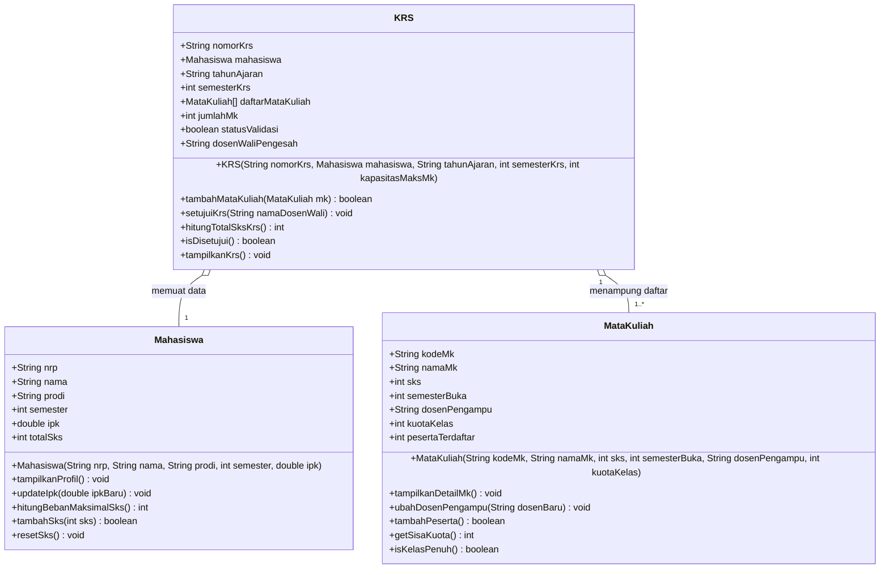

# 🎓 Sistem Informasi Akademik Mahasiswa (SIAKAD)
### **Praktikum Pemrograman Berorientasi Obyek (PBO) — Modul 2**
**Implementasi Class, Object, Attribute, Method, dan Constructor**  
**Politeknik Elektronika Negeri Surabaya (PENS PSDKU Sumenep)**

---

## 📌 Identitas Praktikum

| Informasi | Keterangan |
| :--- | :--- |
| **Nama Mahasiswa** | **Mohamad Zaky Bahtiar Arifianto** |
| **NRP** | `3125522015` |
| **Program Studi** | D3 Teknik Informatika |
| **Mata Kuliah** | Praktikum Pemrograman Berorientasi Obyek |
| **Dosen Pengampu** | Nirwana Haidar Hari, S.Pd., M.Kom. |
| **Tahun Ajaran** | Semester 3 / 2026 |

---

## 📖 Daftar Isi
1. [Review Hasil P1 & Keterkaitan dengan P2](#-1-review-hasil-p1--keterkaitan-dengan-p2)
2. [Agile Sprint Planning — Modul 2](#-2-agile-sprint-planning--modul-2)
3. [Refinement Kandidat Objek & Class Diagram](#-3-refinement-kandidat-objek--class-diagram)
4. [Tabel Spesifikasi Class, Attribute, Constructor, dan Method](#-4-tabel-spesifikasi-class-attribute-constructor-dan-method)
5. [Implementasi Source Code Java](#-5-implementasi-source-code-java)
6. [Struktur Direktori Proyek](#-6-struktur-direktori-proyek)
7. [Cara Kompilasi dan Menjalankan Program](#-7-cara-kompilasi-dan-menjalankan-program)
8. [Bukti Hasil Running Program](#-8-bukti-hasil-running-program)
9. [Sprint Review & Sprint Retrospective](#-9-sprint-review--sprint-retrospective)
10. [Evaluasi Definition of Done (DoD) Modul 2](#-10-evaluasi-definition-of-done-dod-modul-2)
11. [Target Sprint Berikutnya (P3)](#-11-target-sprint-berikutnya-p3)

---

## 🔄 1. Review Hasil P1 & Keterkaitan dengan P2

Pada praktikum sebelumnya (**Modul 1 — Project Kickoff Berbasis Agile**), telah disepakati bahwa sistem yang dibangun adalah **Sistem Informasi Akademik Mahasiswa (SIAKAD)**.

* **Product Goal**:
  > *"Membangun aplikasi Sistem Informasi Akademik sederhana berbasis Java dan OOP untuk mempermudah pengelolaan data mahasiswa, validasi otomatis batas beban SKS berdasarkan capaian IPK, serta pengambilan mata kuliah (KRS) secara terstruktur dan efisien."*

* **Aktor Sistem**:
  1. **Mahasiswa**: Mengakses profil akademik pribadi, memilih mata kuliah (KRS), dan memantau batas beban SKS.
  2. **Dosen Wali**: Memantau performa studi dan melakukan validasi/pengesahan rencana studi bimbingan.
  3. **Admin Akademik**: Mengelola master data mata kuliah dan daya tampung kuota kelas.

* **3 Kandidat Object dari P1 yang Diimplementasikan pada P2**:
  1. **`Mahasiswa`**: Entitas data diri dan akademik, penghitungan batas SKS berdasarkan IPK.
  2. **`MataKuliah`**: Entitas katalog mata kuliah, bobot SKS, dosen pengampu, dan tracking kuota kelas.
  3. **`KRS` (Kartu Rencana Studi)**: Dokumen pengesahan studi yang mengaitkan `Mahasiswa` dengan kumpulan objek `MataKuliah`, validasi aturan SKS, dan persetujuan Dosen Wali.

---

## 🏃 2. Agile Sprint Planning — Modul 2

### 🎯 2.1 Sprint Goal
> *"Mengimplementasikan minimal 3 class utama proyek SIAKAD (`Mahasiswa`, `MataKuliah`, dan `KRS`) secara utuh mencakup attribute, constructor (dengan keyword `this`), method (tanpa parameter, dengan parameter, dan return value), serta melakukan instansiasi multi-object dan pengujian operasi interaksi antar-objek pada `Main.java` sesuai standar Definition of Done."*

### 📋 2.2 Sprint Backlog P2
| ID | Item Sprint Backlog | Estimasi Bobot | Status Akhir |
| :---: | :--- | :---: | :---: |
| **SB-01** | Melakukan refinement 3 kandidat objek dari P1 dan merancang Class Diagram UML | 15% | `DONE` |
| **SB-02** | Mengimplementasikan class `Mahasiswa` dengan 6 attribute, constructor, dan 5 method | 20% | `DONE` |
| **SB-03** | Mengimplementasikan class `MataKuliah` dengan 7 attribute, constructor, dan 5 method | 20% | `DONE` |
| **SB-04** | Mengimplementasikan class `KRS` dengan agregasi objek, constructor, dan 5 method validasi | 20% | `DONE` |
| **SB-05** | Mengimplementasikan class `Main` untuk instansiasi multi-object dan pengujian seluruh method | 15% | `DONE` |
| **SB-06** | Menyusun laporan resmi Word (`.docx`), dokumentasi `README.md`, dan evaluasi DoD | 10% | `DONE` |

---

## 🧩 3. Refinement Kandidat Objek & Class Diagram

### 📊 3.1 Class Diagram (UML)



---

## 📑 4. Tabel Spesifikasi Class, Attribute, Constructor, dan Method

Berikut adalah hasil perincian (*refinement*) sesuai arahan **Bagian A** dan **Bagian D** Modul 2:

| Nama Class | Attribute (State) | Constructor | Method & Kategori |
| :--- | :--- | :--- | :--- |
| **`Mahasiswa`** | • `nrp` : String<br/>• `nama` : String<br/>• `prodi` : String<br/>• `semester` : int<br/>• `ipk` : double<br/>• `totalSks` : int | `Mahasiswa(nrp, nama, prodi, semester, ipk)` | • **Tanpa Parameter**: `tampilkanProfil()`, `resetSks()`<br/>• **Dengan Parameter**: `updateIpk(double)`, `tambahSks(int)`<br/>• **Return Value**: `hitungBebanMaksimalSks()` (int), `tambahSks(int)` (boolean) |
| **`MataKuliah`** | • `kodeMk` : String<br/>• `namaMk` : String<br/>• `sks` : int<br/>• `semesterBuka` : int<br/>• `dosenPengampu` : String<br/>• `kuotaKelas` : int<br/>• `pesertaTerdaftar` : int | `MataKuliah(kodeMk, namaMk, sks, semBuka, dosen, kuota)` | • **Tanpa Parameter**: `tampilkanDetailMk()`<br/>• **Dengan Parameter**: `ubahDosenPengampu(String)`<br/>• **Return Value**: `tambahPeserta()` (boolean), `getSisaKuota()` (int), `isKelasPenuh()` (boolean) |
| **`KRS`** | • `nomorKrs` : String<br/>• `mahasiswa` : Mahasiswa<br/>• `tahunAjaran` : String<br/>• `semesterKrs` : int<br/>• `daftarMataKuliah` : MataKuliah[]<br/>• `jumlahMk` : int<br/>• `statusValidasi` : boolean<br/>• `dosenWaliPengesah` : String | `KRS(nomorKrs, mahasiswa, tahunAjaran, semesterKrs, kapasitasMaksMk)` | • **Tanpa Parameter**: `tampilkanKrs()`<br/>• **Dengan Parameter**: `tambahMataKuliah(MataKuliah)`, `setujuiKrs(String)`<br/>• **Return Value**: `hitungTotalSksKrs()` (int), `isDisetujui()` (boolean), `tambahMataKuliah(MataKuliah)` (boolean) |

---

## 💻 5. Implementasi Source Code Java

### 📄 5.1 `src/Mahasiswa.java`
```java
/**
 * Class Mahasiswa merepresentasikan entitas mahasiswa dalam Sistem Informasi Akademik (SIAKAD).
 * Memiliki attribute untuk menyimpan data identitas dan akademik mahasiswa,
 * constructor untuk inisialisasi state awal objek, serta method untuk manipulasi dan kalkulasi data.
 * 
 * Praktikum Pemrograman Berorientasi Obyek (PBO) - Modul 2
 * Pengembang: Mohamad Zaky Bahtiar Arifianto (NRP: 3125522015)
 */
public class Mahasiswa {
    // 1. Attributes
    public String nrp;
    public String nama;
    public String prodi;
    public int semester;
    public double ipk;
    public int totalSks;

    // 2. Constructor
    public Mahasiswa(String nrp, String nama, String prodi, int semester, double ipk) {
        this.nrp = nrp;
        this.nama = nama;
        this.prodi = prodi;
        this.semester = semester;
        this.ipk = ipk;
        this.totalSks = 0;
    }

    // 3. Methods
    public void tampilkanProfil() {
        System.out.println("------------------------------------------------------------");
        System.out.println("                 PROFIL AKADEMIK MAHASISWA                  ");
        System.out.println("------------------------------------------------------------");
        System.out.println("NRP               : " + this.nrp);
        System.out.println("Nama Lengkap      : " + this.nama);
        System.out.println("Program Studi     : " + this.prodi);
        System.out.println("Semester          : " + this.semester);
        System.out.printf("IPK Kumulatif     : %.2f\n", this.ipk);
        System.out.println("Batas Maksimal SKS: " + this.hitungBebanMaksimalSks() + " SKS");
        System.out.println("Total SKS Diambil : " + this.totalSks + " SKS");
        System.out.println("Status KRS        : " + (this.totalSks > 0 ? "Aktif Terisi" : "Belum Mengisi"));
        System.out.println("------------------------------------------------------------");
    }

    public void updateIpk(double ipkBaru) {
        if (ipkBaru >= 0.0 && ipkBaru <= 4.0) {
            double ipkLama = this.ipk;
            this.ipk = ipkBaru;
            System.out.printf("[INFO MAHASISWA] IPK mahasiswa %s (%s) diperbarui: %.2f -> %.2f\n", 
                              this.nama, this.nrp, ipkLama, this.ipk);
        } else {
            System.out.println("[PERINGATAN] Nilai IPK tidak valid! Harus berada di rentang 0.00 s/d 4.00.");
        }
    }

    public int hitungBebanMaksimalSks() {
        if (this.ipk >= 3.00) {
            return 24;
        } else if (this.ipk >= 2.50) {
            return 21;
        } else if (this.ipk >= 2.00) {
            return 18;
        } else {
            return 15;
        }
    }

    public boolean tambahSks(int sks) {
        int batasMaks = this.hitungBebanMaksimalSks();
        if (this.totalSks + sks <= batasMaks) {
            this.totalSks += sks;
            return true;
        } else {
            return false;
        }
    }

    public void resetSks() {
        this.totalSks = 0;
        System.out.println("[INFO MAHASISWA] Total SKS untuk " + this.nama + " telah direset menjadi 0.");
    }
}
```

### 📄 5.2 `src/MataKuliah.java`
```java
/**
 * Class MataKuliah merepresentasikan entitas mata kuliah yang ditawarkan dalam kurikulum akademik.
 * Memiliki attribute kode, nama mata kuliah, bobot SKS, dosen pengampu, kuota kelas, serta jumlah peserta.
 * 
 * Praktikum Pemrograman Berorientasi Obyek (PBO) - Modul 2
 * Pengembang: Mohamad Zaky Bahtiar Arifianto (NRP: 3125522015)
 */
public class MataKuliah {
    // 1. Attributes
    public String kodeMk;
    public String namaMk;
    public int sks;
    public int semesterBuka;
    public String dosenPengampu;
    public int kuotaKelas;
    public int pesertaTerdaftar;

    // 2. Constructor
    public MataKuliah(String kodeMk, String namaMk, int sks, int semesterBuka, String dosenPengampu, int kuotaKelas) {
        this.kodeMk = kodeMk;
        this.namaMk = namaMk;
        this.sks = sks;
        this.semesterBuka = semesterBuka;
        this.dosenPengampu = dosenPengampu;
        this.kuotaKelas = kuotaKelas;
        this.pesertaTerdaftar = 0;
    }

    // 3. Methods
    public void tampilkanDetailMk() {
        System.out.println("------------------------------------------------------------");
        System.out.println("                 INFORMASI MATA KULIAH                      ");
        System.out.println("------------------------------------------------------------");
        System.out.println("Kode MK           : " + this.kodeMk);
        System.out.println("Nama Mata Kuliah  : " + this.namaMk);
        System.out.println("Bobot SKS         : " + this.sks + " SKS");
        System.out.println("Semester Buka     : Semester " + this.semesterBuka);
        System.out.println("Dosen Pengampu    : " + this.dosenPengampu);
        System.out.println("Kapasitas Kelas   : " + this.pesertaTerdaftar + " / " + this.kuotaKelas + " Mahasiswa");
        System.out.println("Sisa Kuota Kursi  : " + this.getSisaKuota() + " Kursi");
        System.out.println("Status Ketersediaan: " + (this.isKelasPenuh() ? "[PENUH]" : "[TERSEDIA]"));
        System.out.println("------------------------------------------------------------");
    }

    public void ubahDosenPengampu(String dosenBaru) {
        String dosenLama = this.dosenPengampu;
        this.dosenPengampu = dosenBaru;
        System.out.printf("[INFO MATA KULIAH] Dosen pengampu %s (%s) diubah: '%s' -> '%s'\n",
                          this.namaMk, this.kodeMk, dosenLama, this.dosenPengampu);
    }

    public boolean tambahPeserta() {
        if (!this.isKelasPenuh()) {
            this.pesertaTerdaftar++;
            return true;
        } else {
            return false;
        }
    }

    public int getSisaKuota() {
        return this.kuotaKelas - this.pesertaTerdaftar;
    }

    public boolean isKelasPenuh() {
        return this.pesertaTerdaftar >= this.kuotaKelas;
    }
}
```

### 📄 5.3 `src/KRS.java`
```java
/**
 * Class KRS (Kartu Rencana Studi) merepresentasikan dokumen rencana studi semester mahasiswa.
 * Class ini mengaitkan entitas Mahasiswa dengan kumpulan entitas MataKuliah yang diambil,
 * melakukan validasi kuota batas SKS dan ketersediaan kuota kelas, serta mengelola validasi dosen wali.
 * 
 * Praktikum Pemrograman Berorientasi Obyek (PBO) - Modul 2
 * Pengembang: Mohamad Zaky Bahtiar Arifianto (NRP: 3125522015)
 */
public class KRS {
    // 1. Attributes
    public String nomorKrs;
    public Mahasiswa mahasiswa;            // Agregasi ke Mahasiswa
    public String tahunAjaran;
    public int semesterKrs;
    public MataKuliah[] daftarMataKuliah;  // Koleksi Objek MataKuliah
    public int jumlahMk;
    public boolean statusValidasi;
    public String dosenWaliPengesah;

    // 2. Constructor
    public KRS(String nomorKrs, Mahasiswa mahasiswa, String tahunAjaran, int semesterKrs, int kapasitasMaksMk) {
        this.nomorKrs = nomorKrs;
        this.mahasiswa = mahasiswa;
        this.tahunAjaran = tahunAjaran;
        this.semesterKrs = semesterKrs;
        this.daftarMataKuliah = new MataKuliah[kapasitasMaksMk];
        this.jumlahMk = 0;
        this.statusValidasi = false;
        this.dosenWaliPengesah = "-";
    }

    // 3. Methods
    public boolean tambahMataKuliah(MataKuliah mk) {
        System.out.println(">> [PERMOHONAN KRS] Mahasiswa " + this.mahasiswa.nama + 
                           " mendaftar MK: " + mk.namaMk + " (" + mk.sks + " SKS)...");

        // Validasi 1: Kapasitas array KRS
        if (this.jumlahMk >= this.daftarMataKuliah.length) {
            System.out.println("   [GAGAL] Kapasitas maksimum item kartu rencana studi penuh!");
            return false;
        }

        // Validasi 2: Kuota kelas mata kuliah
        if (mk.isKelasPenuh()) {
            System.out.println("   [GAGAL] Kelas mata kuliah '" + mk.namaMk + "' sudah penuh (" + 
                               mk.pesertaTerdaftar + "/" + mk.kuotaKelas + " Kursi)!");
            return false;
        }

        // Validasi 3: Batas kuota SKS mahasiswa
        int batasSks = this.mahasiswa.hitungBebanMaksimalSks();
        int totalSksSekarang = this.hitungTotalSksKrs();
        if (totalSksSekarang + mk.sks > batasSks) {
            System.out.println("   [GAGAL] Melebihi batas kuota SKS mahasiswa (" + batasSks + " SKS)! " +
                               "Total saat ini: " + totalSksSekarang + " SKS + MK: " + mk.sks + " SKS.");
            return false;
        }

        this.daftarMataKuliah[this.jumlahMk] = mk;
        this.jumlahMk++;
        mk.tambahPeserta();
        this.mahasiswa.tambahSks(mk.sks);

        System.out.println("   [BERHASIL] MK '" + mk.namaMk + "' berhasil ditambahkan ke KRS " + this.nomorKrs);
        System.out.println("   Beban SKS saat ini: " + this.hitungTotalSksKrs() + " / " + batasSks + " SKS");
        return true;
    }

    public void setujuiKrs(String namaDosenWali) {
        if (this.jumlahMk == 0) {
            System.out.println("[PERINGATAN] KRS " + this.nomorKrs + " belum memiliki mata kuliah, tidak dapat disahkan.");
            return;
        }
        this.statusValidasi = true;
        this.dosenWaliPengesah = namaDosenWali;
        System.out.println("[VALIDASI KRS] Dokumen KRS " + this.nomorKrs + " milik " + this.mahasiswa.nama + 
                           " berhasil DISETUJUI & DISAHKAN oleh Dosen Wali: " + this.dosenWaliPengesah);
    }

    public int hitungTotalSksKrs() {
        int total = 0;
        for (int i = 0; i < this.jumlahMk; i++) {
            total += this.daftarMataKuliah[i].sks;
        }
        return total;
    }

    public boolean isDisetujui() {
        return this.statusValidasi;
    }

    public void tampilkanKrs() {
        System.out.println("==========================================================================");
        System.out.println("                     KARTU RENCANA STUDI (KRS)                            ");
        System.out.println("               POLITEKNIK ELEKTRONIKA NEGERI SURABAYA                     ");
        System.out.println("==========================================================================");
        System.out.println("Nomor Registrasi KRS : " + this.nomorKrs);
        System.out.println("Tahun Ajaran / Sem.  : " + this.tahunAjaran + " (Semester " + this.semesterKrs + ")");
        System.out.println("Mahasiswa (NRP/Nama) : " + this.mahasiswa.nrp + " - " + this.mahasiswa.nama);
        System.out.println("Program Studi        : " + this.mahasiswa.prodi);
        System.out.printf("Capaian IPK Lalu     : %.2f (Batas Maksimal Beban: %d SKS)\n", 
                          this.mahasiswa.ipk, this.mahasiswa.hitungBebanMaksimalSks());
        System.out.println("Status Pengesahan    : " + (this.statusValidasi ? "DISETUJUI (VALID)" : "PENDING (BELUM DISETUJUI)"));
        System.out.println("Dosen Wali Pengesah  : " + this.dosenWaliPengesah);
        System.out.println("--------------------------------------------------------------------------");
        System.out.printf("%-4s | %-10s | %-30s | %-5s | %-20s\n", "NO", "KODE", "MATA KULIAH", "SKS", "DOSEN PENGAMPU");
        System.out.println("--------------------------------------------------------------------------");
        if (this.jumlahMk == 0) {
            System.out.println("                  [ Belum ada mata kuliah yang diambil ]                  ");
        } else {
            for (int i = 0; i < this.jumlahMk; i++) {
                MataKuliah mk = this.daftarMataKuliah[i];
                System.out.printf("%-4d | %-10s | %-30s | %-5d | %-20s\n", 
                                  (i + 1), mk.kodeMk, mk.namaMk, mk.sks, mk.dosenPengampu);
            }
        }
        System.out.println("--------------------------------------------------------------------------");
        System.out.printf("TOTAL SKS TERDAFTAR : %d SKS\n", this.hitungTotalSksKrs());
        System.out.println("==========================================================================\n");
    }
}
```

### 📄 5.4 `src/Main.java`
```java
/**
 * Class Main merupakan titik masuk utama (entry point) pengujian program Praktikum PBO Modul 2.
 * Menguji implementasi 3 Class (Mahasiswa, MataKuliah, KRS), instansiasi multi-object,
 * eksekusi method (tanpa parameter, dengan parameter, dan return value), serta manipulasi state.
 * 
 * Praktikum Pemrograman Berorientasi Obyek (PBO) - Modul 2
 * Pengembang: Mohamad Zaky Bahtiar Arifianto (NRP: 3125522015)
 * Institusi : Politeknik Elektronika Negeri Surabaya (PENS PSDKU Sumenep)
 */
public class Main {
    public static void main(String[] args) {
        System.out.println("==========================================================================");
        System.out.println("     PRAKTIKUM PEMROGRAMAN BERORIENTASI OBYEK (PBO) - MODUL 2             ");
        System.out.println("   Implementasi Class, Object, Attribute, Method, dan Constructor         ");
        System.out.println("==========================================================================");
        System.out.println("Pengembang   : Mohamad Zaky Bahtiar Arifianto");
        System.out.println("NRP          : 3125522015");
        System.out.println("Program Studi: D3 Teknik Informatika");
        System.out.println("Institusi    : PENS PSDKU Sumenep\n");

        // 1. Instansiasi Multi-Object Melalui Constructor
        System.out.println(">>> 1. INSTANSIASI MULTI-OBJECT MENGGUNAKAN CONSTRUCTOR");
        System.out.println("--------------------------------------------------------------------------");
        Mahasiswa mhs1 = new Mahasiswa("3125522015", "Mohamad Zaky Bahtiar Arifianto", "D3 Teknik Informatika", 3, 3.82);
        Mahasiswa mhs2 = new Mahasiswa("3125522022", "Ahmad Wildan Prasetyo", "D3 Teknik Informatika", 3, 2.45);

        MataKuliah mk1 = new MataKuliah("IF201", "Pemrograman Berorientasi Obyek", 3, 3, "Nirwana Haidar Hari, S.Pd., M.Kom.", 30);
        MataKuliah mk2 = new MataKuliah("IF202", "Praktikum PBO", 2, 3, "Nirwana Haidar Hari, S.Pd., M.Kom.", 30);
        MataKuliah mk3 = new MataKuliah("IF203", "Basis Data Lanjut", 3, 3, "Firman Arifin, S.T., M.T.", 2);
        MataKuliah mk4 = new MataKuliah("IF204", "Rekayasa Perangkat Lunak", 3, 3, "Budi Raharjo, S.Kom., M.Kom.", 25);
        MataKuliah mk5 = new MataKuliah("IF205", "Jaringan Komputer", 3, 3, "Hendra Kusuma, S.Kom., M.T.", 30);

        KRS krs1 = new KRS("KRS-2026-001", mhs1, "2026/2027 Ganjil", 3, 8);
        KRS krs2 = new KRS("KRS-2026-002", mhs2, "2026/2027 Ganjil", 3, 8);

        System.out.println("[STATUS] Objek mhs1, mhs2, mk1-mk5, dan krs1-krs2 berhasil dibuat di memori.\n");

        // 2. Menjalankan Method Tanpa Parameter
        System.out.println(">>> 2. MENJALANKAN METHOD TANPA PARAMETER (MENAMPILKAN DATA AWAL)");
        System.out.println("--------------------------------------------------------------------------");
        mhs1.tampilkanProfil();
        mhs2.tampilkanProfil();

        System.out.println("\n[Informasi Detail Sebagian Mata Kuliah Dibuka]:");
        mk1.tampilkanDetailMk();
        mk3.tampilkanDetailMk();
        System.out.println();

        // 3. Menjalankan Method Dengan Parameter (Perubahan Data State)
        System.out.println(">>> 3. MENJALANKAN METHOD DENGAN PARAMETER (PERUBAHAN DATA STATE)");
        System.out.println("--------------------------------------------------------------------------");
        mhs1.updateIpk(3.90);
        mk3.ubahDosenPengampu("Dr. Indah Susilowati, S.T., M.T.");
        System.out.println();

        // 4. Pengujian Transaksi KRS & Validasi Logika Bisnis
        System.out.println(">>> 4. PENGUJIAN TRANSAKSI PENGAMBILAN KRS & VALIDASI LOGIKA BISNIS");
        System.out.println("--------------------------------------------------------------------------");
        System.out.println("[KASUS A] Pengisian KRS Mahasiswa 1 (" + mhs1.nama + "):");
        krs1.tambahMataKuliah(mk1);
        krs1.tambahMataKuliah(mk2);
        krs1.tambahMataKuliah(mk3);
        krs1.tambahMataKuliah(mk4);
        krs1.tambahMataKuliah(mk5);
        System.out.println();

        System.out.println("[KASUS B] Pengisian KRS Mahasiswa 2 (" + mhs2.nama + "):");
        krs2.tambahMataKuliah(mk1);
        krs2.tambahMataKuliah(mk2);
        krs2.tambahMataKuliah(mk3);

        System.out.println("\n[UJI KASUS KHUSUS 1: Kelas Penuh]");
        System.out.println("Mata kuliah " + mk3.namaMk + " kuota: " + mk3.kuotaKelas + ", terdaftar: " + mk3.pesertaTerdaftar);
        boolean statusDaftarPenuh = mk3.tambahPeserta();
        System.out.println("Hasil penambahan peserta langsung pada kelas penuh: " + 
                           (statusDaftarPenuh ? "Sukses" : "Ditolak (Kelas Telah Penuh)"));
        System.out.println();

        // 5. Pengujian Method dengan Return Value
        System.out.println(">>> 5. PENGUJIAN METHOD YANG MENGEMBALIKAN NILAI (RETURN VALUE)");
        System.out.println("--------------------------------------------------------------------------");
        int totalSksMhs1 = krs1.hitungTotalSksKrs();
        int batasSksMhs1 = mhs1.hitungBebanMaksimalSks();
        int sisaKursiMk3 = mk3.getSisaKuota();
        boolean cekPenuhMk3 = mk3.isKelasPenuh();
        boolean statusAccKrs1 = krs1.isDisetujui();

        System.out.println("Total SKS KRS Mahasiswa 1 (hitungTotalSksKrs)    : " + totalSksMhs1 + " SKS");
        System.out.println("Batas Maksimal SKS Mahasiswa 1 (hitungBebanMaks) : " + batasSksMhs1 + " SKS");
        System.out.println("Sisa Kuota Kursi MK Basis Data Lanjut (getSisa)  : " + sisaKursiMk3 + " Kursi");
        System.out.println("Apakah Kelas Basis Data Lanjut Penuh (isPenuh)   : " + cekPenuhMk3);
        System.out.println("Status Pengesahan KRS 1 Saat Ini (isDisetujui)   : " + statusAccKrs1 + " (Belum disahkan)");
        System.out.println();

        // 6. Proses Pengesahan Dosen Wali
        System.out.println(">>> 6. PROSES PENGESAHAN OLEH DOSEN WALI");
        System.out.println("--------------------------------------------------------------------------");
        krs1.setujuiKrs("Nirwana Haidar Hari, S.Pd., M.Kom.");
        krs2.setujuiKrs("Nirwana Haidar Hari, S.Pd., M.Kom.");
        System.out.println("Status Verifikasi KRS 1 Pasca Validasi: " + (krs1.isDisetujui() ? "VALID / RESMI" : "PENDING"));
        System.out.println();

        // 7. Menampilkan Output Hasil Akhir
        System.out.println(">>> 7. LEMBAR CETAK HASIL AKHIR KARTU RENCANA STUDI (KRS)");
        System.out.println("--------------------------------------------------------------------------");
        krs1.tampilkanKrs();
        krs2.tampilkanKrs();

        System.out.println("[REKAP AKHIR PROFIL MAHASISWA PASCA PENGISIAN KRS]");
        mhs1.tampilkanProfil();
        mhs2.tampilkanProfil();

        System.out.println("==========================================================================");
        System.out.println("  SEMUA PENGUJIAN MODUL 2 BERHASIL DISELESAIKAN DENGAN SEMPURNA (DONE)    ");
        System.out.println("==========================================================================");
    }
}
```

---

## 📂 6. Struktur Direktori Proyek

```text
P2_3125522015_Mohamad Zaky Bahtiar Arifianto/
│
├── 3125522015_Mohamad Zaky Bahtiar Arifianto.docx  # Laporan Resmi Praktikum Word
├── README.md                                       # Dokumentasi Proyek Markdown
├── README.pdf                                      # Ringkasan Eksekutif PDF
├── Modul 2- Implementasi Class, Object...pdf       # Buku Panduan Praktikum Modul 2
│
└── src/
    ├── Mahasiswa.java                              # Implementasi Class Mahasiswa
    ├── MataKuliah.java                             # Implementasi Class MataKuliah
    ├── KRS.java                                    # Implementasi Class KRS (Agregasi)
    └── Main.java                                   # Entry Point & Skenario Pengujian Multi-Object
```

---

## 🚀 7. Cara Kompilasi dan Menjalankan Program

Buka terminal PowerShell pada direktori folder praktikum, lalu jalankan perintah:

### ⚙️ 1. Kompilasi Seluruh Source Code Java
```bash
javac -d bin src/*.java
```

### ▶️ 2. Eksekusi Program Utama
```bash
java -cp bin Main
```

---

## 🖥️ 8. Bukti Hasil Running Program

```text
==========================================================================
     PRAKTIKUM PEMROGRAMAN BERORIENTASI OBYEK (PBO) - MODUL 2             
   Implementasi Class, Object, Attribute, Method, dan Constructor         
==========================================================================
Pengembang   : Mohamad Zaky Bahtiar Arifianto
NRP          : 3125522015
Program Studi: D3 Teknik Informatika
Institusi    : PENS PSDKU Sumenep

>>> 1. INSTANSIASI MULTI-OBJECT MENGGUNAKAN CONSTRUCTOR
--------------------------------------------------------------------------
[STATUS] Objek mhs1, mhs2, mk1-mk5, dan krs1-krs2 berhasil dibuat di memori.

>>> 2. MENJALANKAN METHOD TANPA PARAMETER (MENAMPILKAN DATA AWAL)
--------------------------------------------------------------------------
------------------------------------------------------------
                 PROFIL AKADEMIK MAHASISWA                  
------------------------------------------------------------
NRP               : 3125522015
Nama Lengkap      : Mohamad Zaky Bahtiar Arifianto
Program Studi     : D3 Teknik Informatika
Semester          : 3
IPK Kumulatif     : 3.82
Batas Maksimal SKS: 24 SKS
Total SKS Diambil : 0 SKS
Status KRS        : Belum Mengisi
------------------------------------------------------------
------------------------------------------------------------
                 PROFIL AKADEMIK MAHASISWA                  
------------------------------------------------------------
NRP               : 3125522022
Nama Lengkap      : Ahmad Wildan Prasetyo
Program Studi     : D3 Teknik Informatika
Semester          : 3
IPK Kumulatif     : 2.45
Batas Maksimal SKS: 18 SKS
Total SKS Diambil : 0 SKS
Status KRS        : Belum Mengisi
------------------------------------------------------------

[Informasi Detail Sebagian Mata Kuliah Dibuka]:
------------------------------------------------------------
                 INFORMASI MATA KULIAH                      
------------------------------------------------------------
Kode MK           : IF201
Nama Mata Kuliah  : Pemrograman Berorientasi Obyek
Bobot SKS         : 3 SKS
Semester Buka     : Semester 3
Dosen Pengampu    : Nirwana Haidar Hari, S.Pd., M.Kom.
Kapasitas Kelas   : 0 / 30 Mahasiswa
Sisa Kuota Kursi  : 30 Kursi
Status Ketersediaan: [TERSEDIA]
------------------------------------------------------------
------------------------------------------------------------
                 INFORMASI MATA KULIAH                      
------------------------------------------------------------
Kode MK           : IF203
Nama Mata Kuliah  : Basis Data Lanjut
Bobot SKS         : 3 SKS
Semester Buka     : Semester 3
Dosen Pengampu    : Firman Arifin, S.T., M.T.
Kapasitas Kelas   : 0 / 2 Mahasiswa
Sisa Kuota Kursi  : 2 Kursi
Status Ketersediaan: [TERSEDIA]
------------------------------------------------------------

>>> 3. MENJALANKAN METHOD DENGAN PARAMETER (PERUBAHAN DATA STATE)
--------------------------------------------------------------------------
[INFO MAHASISWA] IPK mahasiswa Mohamad Zaky Bahtiar Arifianto (3125522015) diperbarui: 3.82 -> 3.90
[INFO MATA KULIAH] Dosen pengampu Basis Data Lanjut (IF203) diubah: 'Firman Arifin, S.T., M.T.' -> 'Dr. Indah Susilowati, S.T., M.T.'

>>> 4. PENGUJIAN TRANSAKSI PENGAMBILAN KRS & VALIDASI LOGIKA BISNIS
--------------------------------------------------------------------------
[KASUS A] Pengisian KRS Mahasiswa 1 (Mohamad Zaky Bahtiar Arifianto):
>> [PERMOHONAN KRS] Mahasiswa Mohamad Zaky Bahtiar Arifianto mendaftar MK: Pemrograman Berorientasi Obyek (3 SKS)...
   [BERHASIL] MK 'Pemrograman Berorientasi Obyek' berhasil ditambahkan ke KRS KRS-2026-001
   Beban SKS saat ini: 3 / 24 SKS
>> [PERMOHONAN KRS] Mahasiswa Mohamad Zaky Bahtiar Arifianto mendaftar MK: Praktikum PBO (2 SKS)...
   [BERHASIL] MK 'Praktikum PBO' berhasil ditambahkan ke KRS KRS-2026-001
   Beban SKS saat ini: 5 / 24 SKS
>> [PERMOHONAN KRS] Mahasiswa Mohamad Zaky Bahtiar Arifianto mendaftar MK: Basis Data Lanjut (3 SKS)...
   [BERHASIL] MK 'Basis Data Lanjut' berhasil ditambahkan ke KRS KRS-2026-001
   Beban SKS saat ini: 8 / 24 SKS
>> [PERMOHONAN KRS] Mahasiswa Mohamad Zaky Bahtiar Arifianto mendaftar MK: Rekayasa Perangkat Lunak (3 SKS)...
   [BERHASIL] MK 'Rekayasa Perangkat Lunak' berhasil ditambahkan ke KRS KRS-2026-001
   Beban SKS saat ini: 11 / 24 SKS
>> [PERMOHONAN KRS] Mahasiswa Mohamad Zaky Bahtiar Arifianto mendaftar MK: Jaringan Komputer (3 SKS)...
   [BERHASIL] MK 'Jaringan Komputer' berhasil ditambahkan ke KRS KRS-2026-001
   Beban SKS saat ini: 14 / 24 SKS

[KASUS B] Pengisian KRS Mahasiswa 2 (Ahmad Wildan Prasetyo):
>> [PERMOHONAN KRS] Mahasiswa Ahmad Wildan Prasetyo mendaftar MK: Pemrograman Berorientasi Obyek (3 SKS)...
   [BERHASIL] MK 'Pemrograman Berorientasi Obyek' berhasil ditambahkan ke KRS KRS-2026-002
   Beban SKS saat ini: 3 / 18 SKS
>> [PERMOHONAN KRS] Mahasiswa Ahmad Wildan Prasetyo mendaftar MK: Praktikum PBO (2 SKS)...
   [BERHASIL] MK 'Praktikum PBO' berhasil ditambahkan ke KRS KRS-2026-002
   Beban SKS saat ini: 5 / 18 SKS
>> [PERMOHONAN KRS] Mahasiswa Ahmad Wildan Prasetyo mendaftar MK: Basis Data Lanjut (3 SKS)...
   [BERHASIL] MK 'Basis Data Lanjut' berhasil ditambahkan ke KRS KRS-2026-002
   Beban SKS saat ini: 8 / 18 SKS

[UJI KASUS KHUSUS 1: Kelas Penuh]
Mata kuliah Basis Data Lanjut kuota: 2, terdaftar: 2
Hasil penambahan peserta langsung pada kelas penuh: Ditolak (Kelas Telah Penuh)

>>> 5. PENGUJIAN METHOD YANG MENGEMBALIKAN NILAI (RETURN VALUE)
--------------------------------------------------------------------------
Total SKS KRS Mahasiswa 1 (hitungTotalSksKrs)    : 14 SKS
Batas Maksimal SKS Mahasiswa 1 (hitungBebanMaks) : 24 SKS
Sisa Kuota Kursi MK Basis Data Lanjut (getSisa)  : 0 Kursi
Apakah Kelas Basis Data Lanjut Penuh (isPenuh)   : true
Status Pengesahan KRS 1 Saat Ini (isDisetujui)   : false (Belum disahkan)

>>> 6. PROSES PENGESAHAN OLEH DOSEN WALI
--------------------------------------------------------------------------
[VALIDASI KRS] Dokumen KRS KRS-2026-001 milik Mohamad Zaky Bahtiar Arifianto berhasil DISETUJUI & DISAHKAN oleh Dosen Wali: Nirwana Haidar Hari, S.Pd., M.Kom.
[VALIDASI KRS] Dokumen KRS KRS-2026-002 milik Ahmad Wildan Prasetyo berhasil DISETUJUI & DISAHKAN oleh Dosen Wali: Nirwana Haidar Hari, S.Pd., M.Kom.
Status Verifikasi KRS 1 Pasca Validasi: VALID / RESMI

>>> 7. LEMBAR CETAK HASIL AKHIR KARTU RENCANA STUDI (KRS)
--------------------------------------------------------------------------
==========================================================================
                     KARTU RENCANA STUDI (KRS)                            
               POLITEKNIK ELEKTRONIKA NEGERI SURABAYA                     
==========================================================================
Nomor Registrasi KRS : KRS-2026-001
Tahun Ajaran / Sem.  : 2026/2027 Ganjil (Semester 3)
Mahasiswa (NRP/Nama) : 3125522015 - Mohamad Zaky Bahtiar Arifianto
Program Studi        : D3 Teknik Informatika
Capaian IPK Lalu     : 3.90 (Batas Maksimal Beban: 24 SKS)
Status Pengesahan    : DISETUJUI (VALID)
Dosen Wali Pengesah  : Nirwana Haidar Hari, S.Pd., M.Kom.
--------------------------------------------------------------------------
NO   | KODE       | MATA KULIAH                    | SKS   | DOSEN PENGAMPU      
--------------------------------------------------------------------------
1    | IF201      | Pemrograman Berorientasi Obyek | 3     | Nirwana Haidar Hari, S.Pd., M.Kom.
2    | IF202      | Praktikum PBO                  | 2     | Nirwana Haidar Hari, S.Pd., M.Kom.
3    | IF203      | Basis Data Lanjut              | 3     | Dr. Indah Susilowati, S.T., M.T.
4    | IF204      | Rekayasa Perangkat Lunak       | 3     | Budi Raharjo, S.Kom., M.Kom.
5    | IF205      | Jaringan Komputer              | 3     | Hendra Kusuma, S.Kom., M.T.
--------------------------------------------------------------------------
TOTAL SKS TERDAFTAR : 14 SKS
==========================================================================

==========================================================================
                     KARTU RENCANA STUDI (KRS)                            
               POLITEKNIK ELEKTRONIKA NEGERI SURABAYA                     
==========================================================================
Nomor Registrasi KRS : KRS-2026-002
Tahun Ajaran / Sem.  : 2026/2027 Ganjil (Semester 3)
Mahasiswa (NRP/Nama) : 3125522022 - Ahmad Wildan Prasetyo
Program Studi        : D3 Teknik Informatika
Capaian IPK Lalu     : 2.45 (Batas Maksimal Beban: 18 SKS)
Status Pengesahan    : DISETUJUI (VALID)
Dosen Wali Pengesah  : Nirwana Haidar Hari, S.Pd., M.Kom.
--------------------------------------------------------------------------
NO   | KODE       | MATA KULIAH                    | SKS   | DOSEN PENGAMPU      
--------------------------------------------------------------------------
1    | IF201      | Pemrograman Berorientasi Obyek | 3     | Nirwana Haidar Hari, S.Pd., M.Kom.
2    | IF202      | Praktikum PBO                  | 2     | Nirwana Haidar Hari, S.Pd., M.Kom.
3    | IF203      | Basis Data Lanjut              | 3     | Dr. Indah Susilowati, S.T., M.T.
--------------------------------------------------------------------------
TOTAL SKS TERDAFTAR : 8 SKS
==========================================================================

[REKAP AKHIR PROFIL MAHASISWA PASCA PENGISIAN KRS]
------------------------------------------------------------
                 PROFIL AKADEMIK MAHASISWA                  
------------------------------------------------------------
NRP               : 3125522015
Nama Lengkap      : Mohamad Zaky Bahtiar Arifianto
Program Studi     : D3 Teknik Informatika
Semester          : 3
IPK Kumulatif     : 3.90
Batas Maksimal SKS: 24 SKS
Total SKS Diambil : 14 SKS
Status KRS        : Aktif Terisi
------------------------------------------------------------
------------------------------------------------------------
                 PROFIL AKADEMIK MAHASISWA                  
------------------------------------------------------------
NRP               : 3125522022
Nama Lengkap      : Ahmad Wildan Prasetyo
Program Studi     : D3 Teknik Informatika
Semester          : 3
IPK Kumulatif     : 2.45
Batas Maksimal SKS: 18 SKS
Total SKS Diambil : 8 SKS
Status KRS        : Aktif Terisi
------------------------------------------------------------
==========================================================================
  SEMUA PENGUJIAN MODUL 2 BERHASIL DISELESAIKAN DENGAN SEMPURNA (DONE)    
==========================================================================
```

---

## 📈 9. Sprint Review & Sprint Retrospective

### 📋 9.1 Sprint Review
| Item Evaluasi | Hasil Pencapaian |
| :--- | :--- |
| **Class berhasil dibuat** | Terpenuhi 100% (3 class domain: `Mahasiswa`, `MataKuliah`, `KRS` + 1 class pengujian `Main`). |
| **Object berhasil dibuat** | Terpenuhi (minimal 2 objek untuk setiap class: `mhs1`, `mhs2`, `mk1`-`mk5`, `krs1`, `krs2`). |
| **Constructor berjalan** | Terpenuhi (seluruh class menginisialisasi state lewat constructor berparameter dan `this`). |
| **Method berjalan** | Terpenuhi (method tanpa parameter, dengan parameter, dan return value dieksekusi sukses). |
| **Program dapat dijalankan**| Terpenuhi (zero error/warning pada saat kompilasi dan runtime Java). |
| **Kendala yang ditemukan**  | Penanganan kapasitas array tetap pada class `KRS` memerlukan pengecekan bounds manual sebelum memasukkan elemen baru. Telah ditangani dengan validasi ukuran array sebelum penambahan mata kuliah. |

### 🔍 9.2 Sprint Retrospective
* **What Went Well?**  
  Implementasi class, constructor, dan method berhasil memodelkan alur bisnis SIAKAD secara realistis. Validasi kuota kelas dan batas beban SKS berdasarkan IPK dapat berjalan otomatis antar-objek secara sinergis.
* **What Went Wrong?**  
  Pada tahap awal perancangan, atribut pada class masih berstatus `public` sehingga secara teknis data state dapat diubah langsung dari luar class tanpa melalui validasi method.
* **Improvement:**  
  Menerapkan prinsip **Encapsulation** pada sprint berikutnya (P3) dengan mengubah access modifier attribute menjadi `private`, serta menyediakan method accessor (*getter*) dan mutator (*setter*) yang dilengkapi validasi ketat.

---

## 🎯 10. Evaluasi Definition of Done (DoD) Modul 2

| Kriteria Definition of Done (DoD) | Status | Keterangan Evaluasi |
| :--- | :---: | :--- |
| **Menggunakan proyek P1** | **TERPENUHI** | Melanjutkan proyek SIAKAD dengan kandidat objek dari P1. |
| **Minimal 3 class dibuat** | **TERPENUHI** | Dibuat 3 class domain (`Mahasiswa`, `MataKuliah`, `KRS`) dan 1 class `Main`. |
| **Setiap class memiliki minimal 3 attribute** | **TERPENUHI** | `Mahasiswa` (6 attr), `MataKuliah` (7 attr), `KRS` (7 attr). |
| **Setiap class memiliki constructor** | **TERPENUHI** | Seluruh class memiliki constructor inisialisasi dengan kata kunci `this`. |
| **Setiap class memiliki minimal 2 method utama** | **TERPENUHI** | Masing-masing class memiliki minimal 5 method fungsional. |
| **Terdapat method dengan parameter** | **TERPENUHI** | Contoh: `updateIpk(double)`, `ubahDosenPengampu(String)`, `tambahMataKuliah(MataKuliah)`, `setujuiKrs(String)`. |
| **Terdapat method dengan return value** | **TERPENUHI** | Contoh: `hitungBebanMaksimalSks()` (int), `getSisaKuota()` (int), `isKelasPenuh()` (boolean), `hitungTotalSksKrs()` (int). |
| **Minimal 2 object dibuat dari setiap class** | **TERPENUHI** | Diinstansiasi `mhs1`, `mhs2`, `mk1`-`mk5`, `krs1`, `krs2`. |
| **Seluruh object dapat digunakan dari Main** | **TERPENUHI** | Seluruh objek dipanggil, dimanipulasi, dan diverifikasi di dalam `Main.java`. |
| **Program berhasil dikompilasi** | **TERPENUHI** | `javac -d bin src/*.java` berhasil tanpa pesan error. |
| **Program berhasil dijalankan** | **TERPENUHI** | `java -cp bin Main` berhasil mengeksekusi semua alur dengan sempurna. |
| **Sprint Backlog diperbarui** | **TERPENUHI** | Seluruh item backlog berstatus `DONE`. |
| **Sprint Review tersedia** | **TERPENUHI** | Tabel evaluasi review telah terisi lengkap. |
| **Sprint Retrospective tersedia** | **TERPENUHI** | Analisis *What Went Well*, *What Went Wrong*, dan *Improvement* disajikan jelas. |

---

## 🔮 11. Target Sprint Berikutnya (P3)

Hasil implementasi Modul 2 menjadi fondasi langsung untuk **Modul 3 (Encapsulation dan Access Modifier)**:
1. Menutup akses publik langsung terhadap atribut class dengan menerapkan access modifier `private`.
2. Menyediakan method **Getter** untuk pembacaan data dan **Setter** yang dilengkapi logika validasi integritas data (misal batas minimum/maksimum SKS, format kode MK, dan batas IPK).
3. Meningkatkan keamanan dan keterandalan arsitektur program berorientasi obyek.
