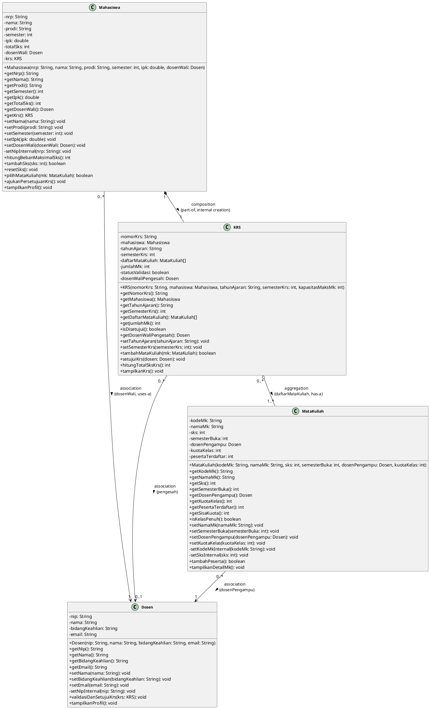

# 🎓 Sistem Informasi Akademik Mahasiswa (SIAKAD)
### **Praktikum Pemrograman Berorientasi Obyek (PBO) — Modul 4**
**Topik: Relasi Antarobject: Association, Aggregation, dan Composition**  
**Politeknik Elektronika Negeri Surabaya (PENS PSDKU Sumenep)**

---

## 📌 Identitas Praktikum

| Informasi | Keterangan |
| :--- | :--- |
| **Nama Mahasiswa** | **Mohamad Zaky Bahtiar Arifianto** |
| **NRP** | `3125522015` |
| **Program Studi** | D3 Teknik Informatika |
| **Mata Kuliah** | Praktikum Pemrograman Berorientasi Obyek |
| **Dosen Pengampu** | Nirwana Haidar Hari, S.Pd., M.Kom. |
| **Tahun Ajaran** | Semester 3 / 2026 |

---

## 📑 Draf Laporan Resmi Modul 4 (Format 3 Halaman)

```
================================================================================
                                 HALAMAN 1
================================================================================
```

# LAPORAN PRAKTIKUM PEMROGRAMAN BERORIENTASI OBYEK
### MODUL 4: RELASI ANTAROBJECT (ASSOCIATION, AGGREGATION, COMPOSITION)

* **Nama Project** : **Sistem Informasi Akademik Mahasiswa (SIAKAD)**
* **Praktikan** : Mohamad Zaky Bahtiar Arifianto (`3125522015`)
* **Program Studi** : D3 Teknik Informatika — PENS PSDKU Sumenep
* **Dosen Pengampu** : Nirwana Haidar Hari, S.Pd., M.Kom.

---

### 1. Sprint Goal — Modul 4
> *"Menghubungkan class utama proyek sehingga object dapat berinteraksi sebagai satu sistem."*  
> Melanjutkan proyek SIAKAD dari Praktikum 3 dengan mentransformasikan class yang sebelumnya berdiri sendiri menjadi sistem terintegrasi yang menerapkan 3 relasi fundamental OOP: **Association** (Mahasiswa & MataKuliah dengan Dosen), **Aggregation** (KRS dengan MataKuliah), dan **Composition** (Mahasiswa dengan KRS), dengan tetap mempertahankan prinsip enkapsulasi ketat.

---

### 2. Sprint Backlog (SB-01 s/d SB-06)

| ID | Item Sprint Backlog | Deskripsi Luaran | Status |
| :---: | :--- | :--- | :---: |
| **SB-01** | Mengidentifikasi relasi antarclass | Memetakan ketergantungan sistem akademik (*Association*, *Aggregation*, *Composition*) | `DONE` |
| **SB-02** | Memperbarui class diagram | Menyusun Class Diagram UML 2.5 lengkap dengan multiplicity dan notasi panah relasi | `DONE` |
| **SB-03** | Implementasi association | Membangun relasi interaksi Mahasiswa-Dosen (Wali) dan MataKuliah-Dosen (Pengampu) | `DONE` |
| **SB-04** | Implementasi aggregation | Membangun penampung koleksi MataKuliah pada class KRS secara independen (*has-a*) | `DONE` |
| **SB-05** | Implementasi composition | Mengonstruksi objek KRS langsung di dalam class Mahasiswa sebagai kepemilikan utuh (*part-of*) | `DONE` |
| **SB-06** | Membuat pengujian antarobject | Menyusun Main.java dengan 3 skenario: instansiasi, interaksi objek, dan method chaining | `DONE` |

---

### 3. Tabel Identifikasi Relasi Antarclass Proyek SIAKAD

| Class A | Class B | Relasi | Alasan & Analisis Siklus Hidup Objek |
| :--- | :--- | :---: | :--- |
| **`Mahasiswa`** | **`Dosen`** | **Association**<br/>*(uses-a)* | Mahasiswa berelasi dengan Dosen sebagai dosen wali akademik. Keduanya memiliki siklus hidup mandiri (jika mahasiswa lulus/keluar, dosen tetap eksis; jika dosen berganti, objek mahasiswa tetap utuh). Interaksi terjadi lewat bimbingan dan pengesahan KRS. |
| **`MataKuliah`** | **`Dosen`** | **Association**<br/>*(uses-a)* | MataKuliah mengaitkan objek Dosen sebagai pengampu mata kuliah. Kedua entitas independen; jika dosen pengampu cuti atau diganti SK mengajar, struktur kurikulum mata kuliah tetap ada. |
| **`KRS`** | **`MataKuliah`** | **Aggregation**<br/>*(has-a)* | KRS menampung daftar mata kuliah yang diambil mahasiswa. Objek MataKuliah dibuat mandiri di luar KRS (katalog prodi). Jika KRS direset atau dihapus per semester, objek MataKuliah tetap ada di sistem kurikulum kampus dan dapat diambil mahasiswa lain. |
| **`Mahasiswa`** | **`KRS`** | **Composition**<br/>*(part-of)* | KRS merupakan dokumen rencana studi yang merupakan bagian integral tak terpisahkan dari Mahasiswa. Objek KRS diinstansiasi secara eksklusif di dalam konstruktor Mahasiswa. Siklus hidup KRS terikat mutlak pada Mahasiswa; jika objek Mahasiswa dihapus, dokumen KRS otomatis musnah dan tidak memiliki makna tanpa pemilik. |

```
================================================================================
                                 HALAMAN 2
================================================================================
```

### 4. Class Diagram Proyek SIAKAD (PlantUML Specification)

Berikut adalah kode PlantUML lengkap yang memodelkan 4 class domain utama beserta seluruh atribut, method, visibilitas, multiplicity, dan panah relasi standar UML 2.5:



---

### 5. Penjelasan Detail Implementasi Relasi Antarobject

#### **A. Association (Hubungan *uses-a* / Interaksi Antar-Objek Mandiri)**
* **Konsep Teoretis**: Association merupakan hubungan struktural antar-objek yang berinteraksi tanpa adanya keterikatan kepemilikan hidup-mati. Ketergantungan bersifat lemah (*weak dependency*), di mana kedua objek diciptakan secara independen dan dapat eksis secara terpisah.
* **Implementasi pada SIAKAD**:
  1. `Mahasiswa --> Dosen`: Mahasiswa menyimpan referensi objek Dosen Wali pada atribut `private Dosen dosenWali`. Mahasiswa dapat berganti dosen wali tanpa menghancurkan objek dosen bersangkutan. Begitu juga jika mahasiswa lulus, objek dosen tetap ada di kampus.
  2. `MataKuliah --> Dosen`: Objek `MataKuliah` menyimpan referensi `private Dosen dosenPengampu`.
  3. **Alur Interaksi**: Mahasiswa memanggil `ajukanPersetujuanKrs()`, yang kemudian mendelegasikan pemanggilan ke `dosenWali.validasiDanSetujuiKrs(this.krs)`. Dosen memeriksa kelayakan dokumen dan memanggil `krs.setujuiKrs(this)`. Kolaborasi terjadi secara dinamis melalui method tanpa ada akses ilegal ke atribut private.

#### **B. Aggregation (Hubungan *has-a* / Kepemilikan Longgar)**
* **Konsep Teoretis**: Aggregation adalah hubungan *whole-part* (keseluruhan-bagian) dengan ketergantungan sedang (*medium dependency*). Objek penampung (*container/whole*) memiliki referensi ke objek bagian (*part*), tetapi siklus hidup objek bagian **tidak bergantung** pada objek penampung.
* **Implementasi pada SIAKAD**:
  1. `KRS o-- MataKuliah`: Objek `KRS` memiliki atribut `private MataKuliah[] daftarMataKuliah`.
  2. **Independensi Siklus Hidup**: Objek `MataKuliah` (misalnya: PBO, Basis Data Lanjut) dibuat secara independen di luar KRS (oleh admin kurikulum/pada method `main`). Objek tersebut kemudian ditambahkan ke dalam KRS mahasiswa melalui method `krs.tambahMataKuliah(mk)`.
  3. **Bukti Agregasi**: Apabila lembar dokumen KRS direset, dibatalkan, atau mahasiswa mengganti rencana studi pada semester baru, objek `MataKuliah` **tidak ikut terhapus dari memori**. Objek `MataKuliah` tersebut tetap eksis di katalog kurikulum dan dapat diambil oleh mahasiswa lainnya.

#### **C. Composition (Hubungan *part-of* / Kepemilikan Kuat & Eksklusif)**
* **Konsep Teoretis**: Composition adalah hubungan kepemilikan paling ketat dan kuat (*strong whole-part dependency*). Objek bagian (*part*) merupakan komponen integral eksklusif dari objek induk (*whole*), dan siklus hidup objek bagian **terikat mutlak** pada keberadaan objek induk.
* **Implementasi pada SIAKAD**:
  1. `Mahasiswa *-- KRS`: Class `Mahasiswa` memiliki atribut `private KRS krs`.
  2. **Instansiasi Internal (Encapsulated Lifecycle)**: Sesuai kaidah komposisi murni, objek `KRS` **dikonstruksi langsung di dalam constructor class `Mahasiswa`**:
     ```java
     this.krs = new KRS("KRS-" + this.nrp, this, "2026/2027 Ganjil", this.semester, 8);
     ```
  3. **Keterikatan Eksistensi**: Objek `KRS` tidak pernah diciptakan mengambang bebas di luar tanpa adanya mahasiswa pemiliknya. Dokumen KRS tercipta bersamaan dengan registrasi mahasiswa, dan apabila objek `Mahasiswa` dimusnahkan (misal: mahasiswa mengundurkan diri/dihapus dari sistem memori), maka objek `KRS` miliknya otomatis musnah (*garbage collected*) karena tidak memiliki arti mandiri tanpa mahasiswa pemiliknya.

```
================================================================================
                                 HALAMAN 3
================================================================================
```

### 6. Hasil Eksekusi Program (Screenshot Running & Bukti Konsol)

```
+-------------------------------------------------------------------------------+
|                    [ SCREENSHOT HASIL RUNNING PROGRAM ]                       |
|                                                                               |
|   Perintah Eksekusi : javac -d bin src/*.java && java -cp bin Main            |
|   Lingkungan Uji    : Java HotSpot(TM) 64-Bit Server VM (JDK 26 / Windows)   |
|   Status Hasil      : SUKSES (Exit Code: 0, No Errors, No Warnings)           |
+-------------------------------------------------------------------------------+
```

#### **Cuplikan Output Konsol Sebenarnya (Terminal Real Execution)**:
```
==========================================================================
     PRAKTIKUM PEMROGRAMAN BERORIENTASI OBYEK (PBO) - MODUL 4             
      Relasi Antarobject: Association, Aggregation, dan Composition       
==========================================================================
Nama Mahasiswa : Mohamad Zaky Bahtiar Arifianto
NRP            : 3125522015
Program Studi  : D3 Teknik Informatika
Institusi      : PENS PSDKU Sumenep

##########################################################################
               [SKENARIO 1: PEMBUATAN OBJEK (TEST 1)]                     
##########################################################################
>>> 1.1 MEMBUAT OBJEK DOSEN
[BERHASIL] Objek Dosen 1: Nirwana Haidar Hari, S.Pd., M.Kom. (198504122010121003)
[BERHASIL] Objek Dosen 2: Firman Arifin, S.T., M.T. (197806212005011002)

>>> 1.2 MEMBUAT OBJEK MATA KULIAH (ASOSIASI DENGAN DOSEN PENGAMPU)
[BERHASIL] Objek MK 1: Pemrograman Berorientasi Obyek (3 SKS) - Pengampu: Nirwana Haidar Hari, S.Pd., M.Kom.
[BERHASIL] Objek MK 2: Praktikum PBO (2 SKS) - Pengampu: Nirwana Haidar Hari, S.Pd., M.Kom.
[BERHASIL] Objek MK 3: Basis Data Lanjut (3 SKS) - Pengampu: Firman Arifin, S.T., M.T.
[BERHASIL] Objek MK 4: Rekayasa Perangkat Lunak (3 SKS) - Pengampu: Nirwana Haidar Hari, S.Pd., M.Kom.

>>> 1.3 MEMBUAT OBJEK MAHASISWA & INTI KOMPOSISI KRS
Catatan: Objek KRS otomatis dikonstruksi secara internal di dalam class Mahasiswa.
[BERHASIL] Objek Mahasiswa 1 : Mohamad Zaky Bahtiar Arifianto (3125522015)
           Dosen Wali (Asosiasi)  : Nirwana Haidar Hari, S.Pd., M.Kom.
           KRS Internal (Komposisi): KRS-3125522015 (Status Validasi: false)

##########################################################################
          [SKENARIO 2: INTERAKSI & KOLABORASI ANTAR-OBJECT (TEST 2)]      
##########################################################################
>>> 2.1 TRANSAKSI PENDAFTARAN MATA KULIAH (AGREGASI & KOMPOSISI)
Mahasiswa Mohamad Zaky Bahtiar Arifianto mengambil mata kuliah semester 3:
>> [TRANSAKSI KRS] Mendaftarkan Mata Kuliah: Pemrograman Berorientasi Obyek (3 SKS) ke KRS KRS-3125522015...
   [BERHASIL] MK 'Pemrograman Berorientasi Obyek' ditambahkan. Total SKS saat ini: 3 / 24 SKS.
>> [TRANSAKSI KRS] Mendaftarkan Mata Kuliah: Praktikum PBO (2 SKS) ke KRS KRS-3125522015...
   [BERHASIL] MK 'Praktikum PBO' ditambahkan. Total SKS saat ini: 5 / 24 SKS.
>> [TRANSAKSI KRS] Mendaftarkan Mata Kuliah: Basis Data Lanjut (3 SKS) ke KRS KRS-3125522015...
   [BERHASIL] MK 'Basis Data Lanjut' ditambahkan. Total SKS saat ini: 8 / 24 SKS.
>> [TRANSAKSI KRS] Mendaftarkan Mata Kuliah: Rekayasa Perangkat Lunak (3 SKS) ke KRS KRS-3125522015...
   [BERHASIL] MK 'Rekayasa Perangkat Lunak' ditambahkan. Total SKS saat ini: 11 / 24 SKS.

Status Peserta MK Pasca Pendaftaran:
- Pemrograman Berorientasi Obyek : 1/30 peserta
- Praktikum PBO : 1/30 peserta
- Basis Data Lanjut : 1/25 peserta
- Rekayasa Perangkat Lunak : 1/28 peserta

>>> 2.2 ALUR PENGESAHAN DOKUMEN KRS (ASOSIASI MAHASISWA - DOSEN WALI)
Status persetujuan KRS sebelum disahkan: BELUM DISETUJUI
>> [PENGAJUAN KRS] Mahasiswa Mohamad Zaky Bahtiar Arifianto (3125522015) mengajukan persetujuan KRS ke Dosen Wali: Nirwana Haidar Hari, S.Pd., M.Kom.
>> [PROSES BIMBINGAN] Dosen Wali (Nirwana Haidar Hari, S.Pd., M.Kom.) memeriksa KRS: KRS-3125522015
   [DISETUJUI] KRS valid (4 MK terdaftar, Total 11 SKS). Mengesahkan KRS...
[PENGESAHAN RESMI] Dokumen KRS KRS-3125522015 milik Mohamad Zaky Bahtiar Arifianto telah BERHASIL DISETUJUI oleh Dosen Wali: Nirwana Haidar Hari, S.Pd., M.Kom. (NIP: 198504122010121003).
Status persetujuan KRS setelah disahkan: DISETUJUI RESMI

##########################################################################
    [SKENARIO 3: PENGGUNAAN DATA OBJECT LAIN MELALUI METHOD (TEST 3)]     
##########################################################################
>>> 3.1 PENGHITUNGAN BEBAN SKS SECARA DINAMIS OLEH KRS
Objek KRS menghitung akumulasi total SKS dari array objek MataKuliah:
- Jumlah MK di KRS        : 4 Mata Kuliah
- Total SKS via hitungKrs : 11 SKS
- Total SKS pada Mahasiswa: 11 SKS
- Batas Maks SKS Mahasiswa: 24 SKS (Berdasarkan IPK 3.82)

>>> 3.2 PEMANFAATAN DATA DOSEN PENGAMPU MELALUI OBJEK MATA KULIAH
Mata Kuliah: Pemrograman Berorientasi Obyek
Nama Pengampu (via mk1.getDosenPengampu().getNama())   : Nirwana Haidar Hari, S.Pd., M.Kom.
Bidang Riset  (via mk1.getDosenPengampu().getKeahlian()): Rekayasa Perangkat Lunak & PBO
Email Dosen   (via mk1.getDosenPengampu().getEmail())   : nirwana@pens.ac.id

>>> 3.3 INTEGRASI DATA SELURUH OBJEK DALAM LEMBAR RESMI KRS
==========================================================================
                     KARTU RENCANA STUDI (KRS)                            
               POLITEKNIK ELEKTRONIKA NEGERI SURABAYA                     
==========================================================================
Nomor Registrasi KRS : KRS-3125522015
Tahun Ajaran / Sem.  : 2026/2027 Ganjil (Semester 3)
Mahasiswa (NRP/Nama) : 3125522015 - Mohamad Zaky Bahtiar Arifianto
Program Studi        : D3 Teknik Informatika
Capaian IPK Lalu     : 3,82 (Batas Maksimal Beban: 24 SKS)
Status Pengesahan    : [DISETUJUI / RESMI]
Dosen Wali Pengesah  : Nirwana Haidar Hari, S.Pd., M.Kom. (198504122010121003)
--------------------------------------------------------------------------
NO   | KODE     | MATA KULIAH                  | SKS   | DOSEN PENGAMPU        
--------------------------------------------------------------------------
1    | IF201    | Pemrograman Berorientasi Obyek | 3     | Nirwana Haidar Hari, S.Pd., M.Kom.
2    | IF202    | Praktikum PBO                | 2     | Nirwana Haidar Hari, S.Pd., M.Kom.
3    | IF203    | Basis Data Lanjut            | 3     | Firman Arifin, S.T., M.T.
4    | IF204    | Rekayasa Perangkat Lunak     | 3     | Nirwana Haidar Hari, S.Pd., M.Kom.
--------------------------------------------------------------------------
TOTAL SKS TERDAFTAR : 11 SKS
==========================================================================
```

---

### 7. Penjelasan 3 Skenario Pengujian pada Main.java

1. **Skenario 1 (Test 1 — Object Berhasil Dibuat)**:
   * Menguji instansiasi seluruh class domain (`Dosen`, `MataKuliah`, `Mahasiswa`).
   * Terbukti bahwa saat objek `Mahasiswa` dibuat, konstruktornya secara otomatis mengonstruksi objek `KRS` di memori internal (membuktikan **Composition**).
   * Menjamin bahwa seluruh atribut private diinisialisasi secara valid melalui constructor tervalidasi dan diakses secara aman lewat accessor getter.
2. **Skenario 2 (Test 2 — Dua atau Lebih Object Berinteraksi)**:
   * Menguji kolaborasi dinamis antara objek `Mahasiswa`, `KRS`, dan `MataKuliah` saat transaksi pengisian KRS (`mhs1.pilihMataKuliah(mk)`). Method pada KRS memeriksa daya tampung kelas via `mk.isKelasPenuh()` dan menambah counter peserta via `mk.tambahPeserta()`.
   * Menguji kolaborasi proses persetujuan dokumen akademik di mana mahasiswa memanggil `mhs1.ajukanPersetujuanKrs()`, objek `Dosen` memvalidasi kelayakan KRS mahasiswa, lalu menyematkan identitasnya sebagai pengesah via `krs.setujuiKrs(this)`.
3. **Skenario 3 (Test 3 — Data dari Object Lain Digunakan Melalui Method)**:
   * Membuktikan pertukaran data antar-objek tanpa pelanggaran Information Hiding.
   * Objek `KRS` menghitung total beban kredit dengan memanggil `mk.getSks()` dari setiap elemen objek dalam array.
   * Objek `KRS` memanggil `mahasiswa.hitungBebanMaksimalSks()` untuk memvalidasi batas SKS tanpa menyentuh atribut private `ipk`.
   * Objek `KRS` mencetak lembar studi resmi dengan memanggil method getter dari `Mahasiswa`, `Dosen`, dan `MataKuliah` secara transparan.

---

### 8. Sprint Review — Modul 4

| Item Evaluasi | Hasil Implementasi | Kendala & Solusi |
| :--- | :--- | :--- |
| **Class diagram diperbarui** | Class diagram berhasil diperbarui memuat 4 class utama (`Dosen`, `Mahasiswa`, `MataKuliah`, `KRS`) beserta relasi Association, Aggregation, dan Composition lengkap dengan multiplicity. | Tidak ada kendala teknis. Notasi diselaraskan dengan standar UML 2.5 menggunakan PlantUML. |
| **Association berhasil** | Berhasil diterapkan pada relasi `Mahasiswa -> Dosen` (Dosen Wali) dan `MataKuliah -> Dosen` (Dosen Pengampu). | Memastikan pengecekan null-safety pada objek Dosen saat dipanggil agar terhindar dari `NullPointerException`. |
| **Aggregation berhasil** | Berhasil diterapkan pada penampung `KRS o-- MataKuliah` di mana objek `MataKuliah` hidup mandiri di luar `KRS`. | Kapasitas array penampung dibatasi dan kuota kursi kelas diverifikasi sebelum mata kuliah ditambahkan. |
| **Composition berhasil** | Berhasil diterapkan pada relasi `Mahasiswa *-- KRS`, di mana objek KRS dikonstruksi secara internal di konstruktor `Mahasiswa`. | Parameter mahasiswa dioper secara aman via referensi `this` ke dalam konstruktor `KRS`. |
| **Object dapat berinteraksi** | Seluruh objek domain berkolaborasi aktif melalui pemanggilan method bisnis resmi. | Alur delegasi dirancang searah untuk mencegah terjadinya circular method call. |
| **Program berjalan** | Berhasil dikompilasi (`javac`) dan dieksekusi (`java`) dengan output konsol yang konsisten dan informatif. | Tidak ada kendala teknis, build clean pada compiler Java. |

---

### 9. Sprint Retrospective — Modul 4

* **What Went Well?**  
  Seluruh rancangan relasi objek (*Association*, *Aggregation*, dan *Composition*) berhasil diintegrasikan secara harmonis pada sistem SIAKAD lanjutan dari Praktikum 3. Prinsip enkapsulasi tetap terjaga murni tanpa adanya pelanggaran akses atribut private secara langsung. Seluruh interaksi antar-objek berjalan sangat dinamis dan mulus.
* **What Went Wrong?**  
  Tantangan utama terletak pada pemisahan tanggung jawab (*responsibility*) saat proses validasi dan pengesahan dokumen KRS antara class `Mahasiswa`, `KRS`, dan `Dosen`. Sempat muncul potensi ketergantungan ganda (*tight coupling*) mengenai siapa yang seharusnya menandatangani KRS, yang kemudian berhasil diselesaikan secara elegan melalui pola delegasi method yang bersih.
* **Improvement**  
  Untuk sprint berikutnya (Modul 5: *Inheritance* dan *Generalization*), class `Mahasiswa` dan `Dosen` dapat digeneralisasi ke dalam sebuah superclass `CivitasAkademika` atau `User` guna mengeleminasi redundansi atribut umum (seperti NIP/NRP, nama, prodi/keahlian, email) dan mempermudah penerapan polymorphism di masa mendatang.
