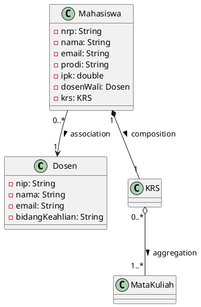
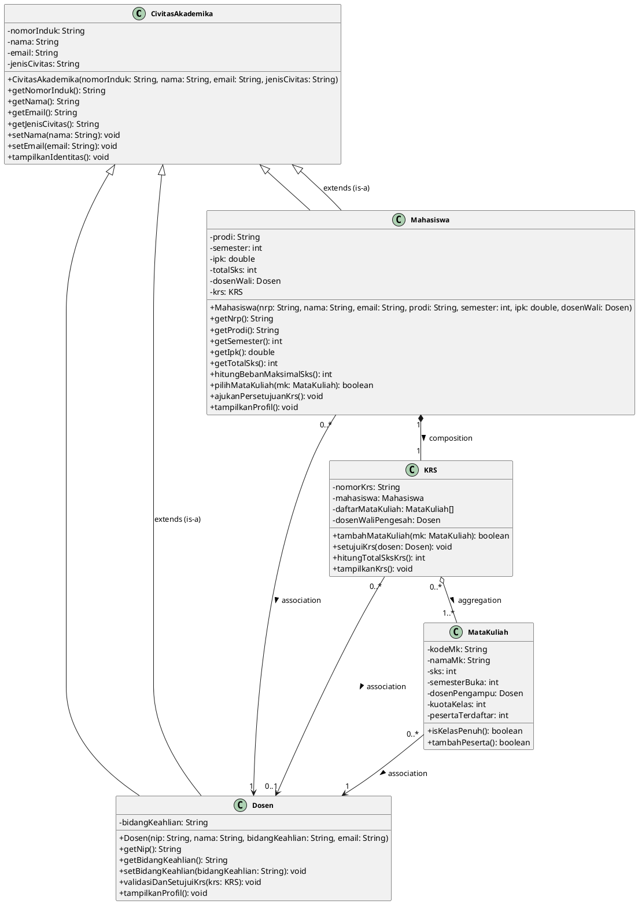

# 🎓 Sistem Informasi Akademik Mahasiswa (SIAKAD)
### **Praktikum Pemrograman Berorientasi Obyek (PBO) — Modul 5**
**Topik: Inheritance, Generalization, Superclass, dan Subclass**  
**Politeknik Elektronika Negeri Surabaya (PENS PSDKU Sumenep)**

---

## 📌 Identitas Praktikum

| Informasi | Keterangan |
| :--- | :--- |
| **Nama Mahasiswa** | **Mohamad Zaky Bahtiar Arifianto** |
| **NRP** | `3125522015` |
| **Program Studi** | D3 Teknik Informatika |
| **Mata Kuliah** | Praktikum Pemrograman Berorientasi Obyek |
| **Dosen Pengampu** | Nirwana Haidar Hari, S.Pd., M.Kom. |
| **Tahun Ajaran** | Semester 3 / 2026 |

---

## 📑 Draf Laporan Resmi Modul 5 (Format 3 Halaman)

```
================================================================================
                                 HALAMAN 1
================================================================================
```

# LAPORAN PRAKTIKUM PEMROGRAMAN BERORIENTASI OBYEK
### MODUL 5: INHERITANCE, GENERALIZATION, SUPERCLASS, DAN SUBCLASS

* **Nama Project** : **Sistem Informasi Akademik Mahasiswa (SIAKAD)**
* **Praktikan** : Mohamad Zaky Bahtiar Arifianto (`3125522015`)
* **Program Studi** : D3 Teknik Informatika — PENS PSDKU Sumenep
* **Dosen Pengampu** : Nirwana Haidar Hari, S.Pd., M.Kom.

---

### 1. Sprint Goal — Modul 5
> *"Memperbaiki desain proyek dengan mengidentifikasi class yang memiliki karakteristik serupa dan melakukan generalization menggunakan inheritance."*  
> Melakukan audit menyeluruh terhadap arsitektur class P4, mengekstrak redundansi atribut dan method pada class `Mahasiswa` dan `Dosen` ke dalam sebuah superclass `CivitasAkademika`, menerapkan pewarisan menggunakan keyword `extends` dan constructor chaining via `super(...)`, serta mempertahankan relasi objek (Association, Aggregation, Composition) yang telah dibangun.

---

### 2. Sprint Backlog (SB-01 s/d SB-07)

| ID | Item Sprint Backlog | Deskripsi Luaran | Status |
| :---: | :--- | :--- | :---: |
| **SB-01** | Mencari class yang memiliki duplikasi | Mengaudit atribut identitas umum (nama, id, email) pada Mahasiswa dan Dosen | `DONE` |
| **SB-02** | Menentukan superclass | Mendefinisikan superclass CivitasAkademika sebagai induk entitas warga kampus | `DONE` |
| **SB-03** | Menentukan subclass | Menetapkan Mahasiswa dan Dosen sebagai turunan spesifik dari CivitasAkademika | `DONE` |
| **SB-04** | Memperbarui class diagram | Menyusun Class Diagram UML baru dengan notasi generalisasi (`<\|--`) dan relasi P4 | `DONE` |
| **SB-05** | Implementasi extends | Menerapkan sintaks `class Subclass extends Superclass` pada kode program Java | `DONE` |
| **SB-06** | Implementasi super | Menerapkan constructor chaining `super(...)` dan akses method superclass yang aman | `DONE` |
| **SB-07** | Melakukan pengujian inheritance | Menyusun Main.java untuk menguji instansiasi, method superclass & subclass | `DONE` |

---

### 3. Audit Class & Pemetaan Generalisasi

| Class Asal (P4) | Attribute Umum (Duplikasi) | Attribute Khusus (Spesifik) | Peran dalam Inheritance |
| :--- | :--- | :--- | :---: |
| **`Mahasiswa`** | • `nomorInduk` (NRP)<br/>• `nama`<br/>• `email` | • `prodi`, `semester`, `ipk`, `totalSks`<br/>• `dosenWali` (Association)<br/>• `krs` (Composition) | **Subclass**<br/>*(Turunan dari CivitasAkademika)* |
| **`Dosen`** | • `nomorInduk` (NIP)<br/>• `nama`<br/>• `email` | • `bidangKeahlian` | **Subclass**<br/>*(Turunan dari CivitasAkademika)* |
| **`CivitasAkademika`**<br/>*(Hasil Refactoring)* | • `nomorInduk`<br/>• `nama`<br/>• `email`<br/>• `jenisCivitas` | - *(Menyediakan method umum: tampilkanIdentitas, accessor/mutator)* | **SUPERCLASS**<br/>*(Generalization Entity)* |

```
================================================================================
                                 HALAMAN 2
================================================================================
```

### 4. Class Diagram: Sebelum Refactoring vs Setelah Refactoring

#### **A. Struktur Class P4 (Sebelum Refactoring - Tanpa Inheritance)**:
Pada P4, class `Mahasiswa` dan `Dosen` berdiri secara terpisah dengan atribut yang berulang (duplikasi nrp/nip, nama, email). Tidak terdapat hirarki pewarisan.



#### **B. Struktur Class P5 (Setelah Refactoring - Dengan Inheritance)**:
Menerapkan Superclass `CivitasAkademika`. Class `Mahasiswa` dan `Dosen` meng-extends superclass (ditandai panah segitiga `<|--`). Seluruh relasi P4 (Association, Aggregation, Composition) tetap utuh dipertahankan.



---

### 5. Penjelasan & Argumentasi Hubungan is-a

Penerapan inheritance pada proyek SIAKAD didasarkan pada pemenuhan prinsip **is-a** yang sahih secara konseptual dan teknis:
1. **Validasi Semantik Domain Pendidikan:** Pernyataan bahwa *"Mahasiswa is-a CivitasAkademika"* dan *"Dosen is-a CivitasAkademika"* adalah kebenaran taksonomi akademik yang mutlak. Baik mahasiswa maupun dosen adalah bagian dari warga kampus (civitas akademika). Relasi ini **bukan** merupakan hubungan kepemilikan (*has-a*), karena seorang Dosen tidak memiliki Mahasiswa, melainkan keduanya berbagi karakteristik dasar kemanusiaan dan identitas institusi yang sama.
2. **Pemenuhan Liskov Substitution Principle (LSP):** Seluruh method dan sifat dasar yang didefinisikan pada superclass `CivitasAkademika` (seperti `getNomorInduk()`, `getNama()`, `getEmail()`, dan `tampilkanIdentitas()`) berlaku secara sah dan bermakna penuh bagi objek `Mahasiswa` maupun `Dosen` tanpa perlu mengubah semantik aslinya. Objek subclass dapat menggantikan tipe referensi superclass (`CivitasAkademika ref = new Mahasiswa(...)`) tanpa merusak perilaku sistem.
3. **Pembedaan dengan Relasi has-a P4:** Hubungan *has-a* tetap dipertahankan pada tempat yang tepat: Mahasiswa *has-a* KRS (Composition), KRS *has-a* MataKuliah (Aggregation), dan Mahasiswa *has-a* Dosen Wali (Association). Generalisasi ini memperjelas pemisahan antara **struktur hierarki jenis objek (is-a)** dengan **jaringan interaksi antar-objek (has-a)**.

```
================================================================================
                                 HALAMAN 3
================================================================================
```

### 6. Hasil Eksekusi Program (Screenshot Running & Bukti Konsol)

```
+-------------------------------------------------------------------------------+
|                    [ TEMPAT SCREENSHOT HASIL RUNNING PROGRAM ]                |
|                                                                               |
|   Perintah Eksekusi : javac -d bin src/*.java && java -cp bin Main            |
|   Lingkungan Uji    : Java HotSpot(TM) 64-Bit Server VM (JDK 26 / Windows)   |
|   Status Hasil      : SUKSES (Exit Code: 0, No Errors, No Warnings)           |
+-------------------------------------------------------------------------------+
```

#### **Cuplikan Output Konsol Sebenarnya (Terminal Real Execution)**:
```
==========================================================================
     PRAKTIKUM PEMROGRAMAN BERORIENTASI OBYEK (PBO) - MODUL 5             
         Inheritance, Generalization, Superclass, dan Subclass            
==========================================================================
Nama Mahasiswa : Mohamad Zaky Bahtiar Arifianto
NRP            : 3125522015
Program Studi  : D3 Teknik Informatika
Institusi      : PENS PSDKU Sumenep

##########################################################################
 [SKENARIO 1: INSTANSIASI SUBCLASS & CONSTRUCTOR CHAINING VIA super()]    
##########################################################################
>>> 1.1 MEMBUAT OBJEK DARI SUBCLASS DOSEN
[BERHASIL] Objek Dosen 1 terinstansiasi melalui super()
[BERHASIL] Objek Dosen 2 terinstansiasi melalui super()

>>> 1.2 MEMBUAT OBJEK DARI SUBCLASS MAHASISWA
[BERHASIL] Objek Mahasiswa 1 terinstansiasi melalui super()
[BERHASIL] Objek Mahasiswa 2 terinstansiasi melalui super()

##########################################################################
      [SKENARIO 2: PEMANGGILAN METHOD DARI SUPERCLASS (INHERITED)]        
##########################################################################
>>> 2.1 MEMANGGIL METHOD GETTER SUPERCLASS PADA OBJEK MAHASISWA:
- Jenis Civitas (getJenisCivitas) : Mahasiswa
- Nomor Induk   (getNomorInduk)   : 3125522015
- Nama Lengkap  (getNama)         : Mohamad Zaky Bahtiar Arifianto
- Email Resmi   (getEmail)        : zaky@student.pens.ac.id

>>> 2.2 MEMANGGIL METHOD GETTER SUPERCLASS PADA OBJEK DOSEN:
- Jenis Civitas (getJenisCivitas) : Dosen
- Nomor Induk   (getNomorInduk)   : 198504122010121003
- Nama Lengkap  (getNama)         : Nirwana Haidar Hari, S.Pd., M.Kom.
- Email Resmi   (getEmail)        : nirwana@pens.ac.id

>>> 2.3 MEMANGGIL METHOD COMMON tampilkanIdentitas() SUPERCLASS SECARA POLIMORFIS:
------------------------------------------------------------
               DATA IDENTITAS CIVITAS AKADEMIKA             
------------------------------------------------------------
Jenis Civitas : Mahasiswa
Nomor Induk   : 3125522015
Nama Lengkap  : Mohamad Zaky Bahtiar Arifianto
Email Resmi   : zaky@student.pens.ac.id
------------------------------------------------------------

##########################################################################
        [SKENARIO 3: PEMANGGILAN METHOD SPESIFIK DARI SUBCLASS]           
##########################################################################
>>> 3.1 METHOD KHUSUS SUBCLASS MAHASISWA:
- Program Studi (getProdi)                 : D3 Teknik Informatika
- Semester Aktif (getSemester)             : Semester 3
- IPK Akademik (getIpk)                    : 3,82
- Batas Maksimal SKS (hitungBebanMaksSks) : 24 SKS

>>> 3.2 METHOD KHUSUS SUBCLASS DOSEN:
- Bidang Keahlian (getBidangKeahlian)      : Rekayasa Perangkat Lunak & PBO

##########################################################################
     [SKENARIO 4: INTEGRASI DENGAN RELASI OBJEK P4 (TETAP TERJAGA)]       
##########################################################################
>>> 4.1 TRANSAKSI AGREGASI MATA KULIAH KE DALAM KRS MAHASISWA:
>> [TRANSAKSI KRS] Mendaftarkan Mata Kuliah: Pemrograman Berorientasi Obyek (3 SKS) ke KRS KRS-3125522015...
   [BERHASIL] MK 'Pemrograman Berorientasi Obyek' ditambahkan. Total SKS saat ini: 3 / 24 SKS.
...
[PENGESAHAN RESMI] Dokumen KRS KRS-3125522015 milik Mohamad Zaky Bahtiar Arifianto telah BERHASIL DISETUJUI oleh Dosen Wali: Nirwana Haidar Hari, S.Pd., M.Kom. (NIP: 198504122010121003).

==========================================================================
  SEMUA PENGUJIAN INHERITANCE MODUL 5 BERHASIL DILALUI DENGAN SUKSES!    
==========================================================================
```

---

### 7. Bukti Penggunaan Keyword extends dan super()

1. **Keyword extends:** Diterapkan pada deklarasi class turunan: `public class Mahasiswa extends CivitasAkademika` dan `public class Dosen extends CivitasAkademika`. Keyword ini mewariskan seluruh atribut private dan method publik dari superclass secara langsung tanpa duplikasi kode.
2. **Keyword super() & Constructor Chaining:** Diterapkan pada baris pertama constructor subclass, misalnya pada Dosen: `super(nip, nama, email, "Dosen");` dan pada Mahasiswa: `super(nrp, nama, email, "Mahasiswa");`.
3. **Urutan Eksekusi Constructor:** Saat objek subclass diinstansiasi (contoh: `new Mahasiswa(...)`), Java secara otomatis mengeksekusi constructor superclass `CivitasAkademika` terlebih dahulu untuk menginisialisasi atribut fondasi (nomorInduk, nama, email), baru kemudian mengeksekusi tubuh constructor subclass `Mahasiswa` untuk atribut khusus (prodi, semester, ipk, pembuatan KRS).
4. **Akses Enkapsulasi:** Subclass tidak pernah mengakses atribut private superclass secara langsung, melainkan melalui method resmi superclass seperti `super.getNomorInduk()` dan `super.getNama()`.

---

### 8. Sprint Review — Modul 5

| Item Evaluasi | Hasil Implementasi | Kendala & Solusi |
| :--- | :--- | :--- |
| **Kandidat inheritance ditemukan** | Ditemukan kesamaan karakteristik antara Mahasiswa dan Dosen (nomorInduk, nama, email). | Menganalisis nama atribut identitas yang berbeda (NRP vs NIP) agar dapat digeneralisasi. |
| **Superclass berhasil dibuat** | Class CivitasAkademika berhasil dibuat memuat 4 atribut umum dan method getter/setter/profil. | Tidak ada kendala, prinsip enkapsulasi dipertahankan murni. |
| **Minimal 2 subclass dibuat** | Class Mahasiswa dan Dosen berhasil direfactor menjadi subclass dari CivitasAkademika. | Menyesuaikan constructor lama agar tetap kompatibel tanpa breaking changes. |
| **extends diterapkan** | Keyword extends berhasil diterapkan pada deklarasi class Mahasiswa dan Dosen. | Tidak ada kendala sintaksis. |
| **super diterapkan** | Constructor chaining via super(...) berhasil diimplementasikan pada seluruh subclass. | Menjamin pemanggilan super(...) diletakkan pada baris pertama constructor. |
| **Class diagram diperbarui** | Class diagram berhasil diperbarui dengan PlantUML menyajikan relasi inheritance & relasi P4. | Menggunakan simbol panah segitiga (`<\|--`) standar UML 2.5. |
| **Program berhasil dijalankan** | Program berhasil dikompilasi (javac) dan dieksekusi (java) dengan output 100% konsisten. | Bersih dari error dan warning. |

---

### 9. Sprint Retrospective — Modul 5

* **What Went Well?**  
  Refactoring generalisasi ke superclass `CivitasAkademika` berhasil mengeliminasi redundansi kode pada class `Mahasiswa` dan `Dosen` tanpa merusak struktur relasi objek P4 (Association, Aggregation, dan Composition). Constructor chaining menggunakan `super(...)` berjalan mulus dan pengujian method superclass/subclass di `Main.java` menghasilkan output yang terstruktur rapi.
* **What Went Wrong?**  
  Tantangan awal muncul saat menyatukan penamaan nomor identitas yang berbeda antara NRP pada Mahasiswa dan NIP pada Dosen. Hal ini berhasil diatasi secara elegan dengan membuat atribut generik `nomorInduk` pada superclass, lalu menyediakan method delegasi `getNrp()` dan `getNip()` pada masing-masing subclass untuk menjaga kompatibilitas pemanggilan sebelumnya.
* **Improvement**  
  Untuk sprint berikutnya (Modul 6: *Polymorphism & Dynamic Method Dispatch*), superclass `CivitasAkademika` dapat dideklarasikan sebagai abstract class dengan abstract method seperti `hitungHakAkses()` atau `cetakKartuIdentitas()` untuk memaksa setiap subclass menyediakan implementasi spesifik, sekaligus memanfaatkan dynamic binding secara maksimal.
