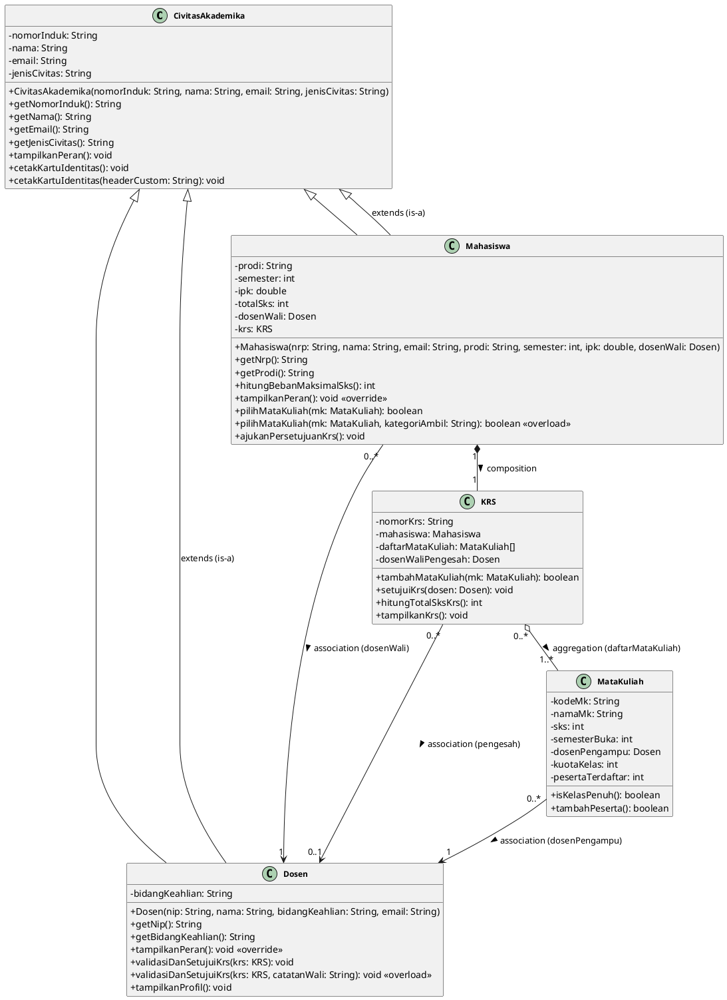

# 🎓 Sistem Informasi Akademik Mahasiswa (SIAKAD)
### **Praktikum Pemrograman Berorientasi Obyek (PBO) — Modul 6**
**Topik: Polymorphism, Method Overriding, Method Overloading, dan Dynamic Binding**  
**Politeknik Elektronika Negeri Surabaya (PENS PSDKU Sumenep)**

---

## 📌 Identitas Praktikum

| Informasi | Keterangan |
| :--- | :--- |
| **Nama Mahasiswa** | **Mohamad Zaky Bahtiar Arifianto** |
| **NRP** | `3125522015` |
| **Program Studi** | D3 Teknik Informatika |
| **Mata Kuliah** | Praktikum Pemrograman Berorientasi Obyek |
| **Dosen Pengampu** | Nirwana Haidar Hari, S.Pd., M.Kom. |
| **Tahun Ajaran** | Semester 3 / 2026 |

---

## 📑 Draf Laporan Resmi Modul 6 (Format 3 Halaman)

```
================================================================================
                                 HALAMAN 1
================================================================================
```

# LAPORAN PRAKTIKUM PEMROGRAMAN BERORIENTASI OBYEK
### MODUL 6: POLYMORPHISM, METHOD OVERRIDING, METHOD OVERLOADING, DAN DYNAMIC BINDING

* **Nama Project** : **Sistem Informasi Akademik Mahasiswa (SIAKAD)**
* **Praktikan** : Mohamad Zaky Bahtiar Arifianto (`3125522015`)
* **Program Studi** : D3 Teknik Informatika — PENS PSDKU Sumenep
* **Dosen Pengampu** : Nirwana Haidar Hari, S.Pd., M.Kom.

---

### 1. Sprint Goal — Modul 6
> *"Mengembangkan behavior object pada proyek melalui method overriding dan polymorphism sehingga subclass dapat merespons pemanggilan method yang sama dengan perilaku berbeda."*  
> Melanjutkan proyek SIAKAD hasil refactoring P5 dengan menambahkan polymorphic behavior menggunakan **Method Overriding** (`@Override`), mengimplementasikan variasi pemanggilan via **Method Overloading**, mengonstruksi koleksi polimorfis berlandaskan **Upcasting**, serta membuktikan mekanisme **Dynamic Binding / Dynamic Method Dispatch** pada saat runtime.

---

### 2. Sprint Backlog (SB-01 s/d SB-07)

| ID | Item Sprint Backlog | Deskripsi Luaran | Status |
| :---: | :--- | :--- | :---: |
| **SB-01** | Audit superclass dan subclass P5 | Memeriksa struktur hirarki class `CivitasAkademika`, `Mahasiswa`, dan `Dosen` | `DONE` |
| **SB-02** | Menentukan behavior yang dapat dioverride | Memilih method `tampilkanPeran()` sebagai signature behavior polimorfis | `DONE` |
| **SB-03** | Implementasi overriding | Menerapkan `@Override public void tampilkanPeran()` pada `Mahasiswa` & `Dosen` | `DONE` |
| **SB-04** | Implementasi overloading sederhana | Membuat method overload pada `pilihMataKuliah` & `validasiDanSetujuiKrs` | `DONE` |
| **SB-05** | Implementasi upcasting | Menyimpan objek aktual subclass ke dalam tipe referensi `CivitasAkademika` | `DONE` |
| **SB-06** | Membuat polymorphic collection | Menyusun array polimorfis `CivitasAkademika[]` berisi objek campuran | `DONE` |
| **SB-07** | Melakukan pengujian dynamic binding | Melakukan looping array dan membuktikan pemanggilan method sesuai objek aktual | `DONE` |

---

### 3. Hierarchy Class Hasil P5 & P6

Struktur pewarisan (*Inheritance Tree*) proyek SIAKAD:

```text
               ┌─────────────────────────────────────────┐
               │            CivitasAkademika             │
               │   (Superclass / Generalization Base)    │
               │        + tampilkanPeran(): void         │
               └────────────────────┬────────────────────┘
                                    ▲
                                    │ extends (is-a)
                     ┌──────────────┴──────────────┐
                     │                             │
   ┌─────────────────┴─────────────┐ ┌─────────────┴─────────────┐
   │           Mahasiswa           │ │            Dosen            │
   │          (Subclass)           │ │          (Subclass)         │
   │   @Override tampilkanPeran()  │ │   @Override tampilkanPeran()│
   └───────────────────────────────┘ └───────────────────────────┘
```

---

### 4. Behavior yang Dipilih untuk Polymorphism

Behavior yang dipilih untuk diimplementasikan secara polimorfis adalah method **`tampilkanPeran()`**:
1. **Pada Superclass `CivitasAkademika`**:
   Mendefinisikan kontrak peran dasar bahwa setiap entitas adalah warga kampus yang berpartisipasi aktif di lingkungan akademik PENS.
2. **Pada Subclass `Mahasiswa` (`@Override`)**:
   Menyajikan perilaku spesifik mahasiswa: menempuh studi pada program studi tertentu, mengambil beban SKS semester aktif, mengisi rencana studi (KRS), dan mengikuti perkuliahan.
3. **Pada Subclass `Dosen` (`@Override`)**:
   Menyajikan perilaku spesifik tenaga pendidik: melaksanakan Tridharma Perguruan Tinggi, membimbing mahasiswa, mengajar mata kuliah sesuai bidang keahlian, dan memvalidasi/mengesahkan dokumen KRS mahasiswa bimbingan.

```
================================================================================
                                 HALAMAN 2
================================================================================
```

### 5. Class Diagram Proyek SIAKAD (PlantUML Specification)

Berikut adalah diagram kelas PlantUML lengkap yang mencerminkan hirarki pewarisan, method yang dioverride, method overload, serta relasi P4 yang tetap dipertahankan:



---

### 6. Contoh Cuplikan Kode Method Overriding

```java
// 1. Pada Superclass CivitasAkademika.java
public void tampilkanPeran() {
    System.out.println("[PERAN CIVITAS] " + this.nama + " (" + this.nomorInduk + 
                       ") berpartisipasi aktif sebagai Warga Kampus / Civitas Akademika PENS.");
}

// 2. Pada Subclass Mahasiswa.java
@Override
public void tampilkanPeran() {
    System.out.println("[PERAN MAHASISWA] " + super.getNama() + " (" + getNrp() + 
                       ") - Menempuh studi pada program " + this.prodi + " (Semester " + this.semester + 
                       "), mengambil beban kredit SKS, dan menyusun rencana studi.");
}

// 3. Pada Subclass Dosen.java
@Override
public void tampilkanPeran() {
    System.out.println("[PERAN DOSEN] " + super.getNama() + " (" + getNip() + 
                       ") - Menjalankan Tridharma Perguruan Tinggi, membimbing mahasiswa, " + 
                       "mengajar pada bidang " + this.bidangKeahlian + ", serta memvalidasi KRS.");
}
```

---

### 7. Contoh Cuplikan Kode Method Overloading

```java
// Method Overloading pada class Mahasiswa (pilihMataKuliah)
// Signature 1: Mendaftarkan mata kuliah reguler
public boolean pilihMataKuliah(MataKuliah mk) {
    return pilihMataKuliah(mk, "Reguler");
}

// Signature 2: Mendaftarkan mata kuliah dengan kategori khusus (Overloaded Method)
public boolean pilihMataKuliah(MataKuliah mk, String kategoriAmbil) {
    if (this.krs != null) {
        System.out.println(">> [REGISTRASI MATA KULIAH] Mahasiswa " + super.getNama() + 
                           " mendaftar mata kuliah kategori: [" + kategoriAmbil + "]");
        return this.krs.tambahMataKuliah(mk);
    }
    return false;
}
```

---

### 8. Penjelasan Konsep Upcasting pada Proyek SIAKAD

* **Konsep Upcasting**: Upcasting adalah proses mengonversi referensi dari tipe *subclass* ke tipe *superclass* di atasnya dalam hirarki pewarisan. Di Java, upcasting bersifat otomatis (*implicit*) dan aman (*type-safe*) karena subclass dijamin memenuhi relasi *is-a* terhadap superclass.
* **Implementasi Proyek**:
  ```java
  CivitasAkademika refCivitas = new Mahasiswa("3125522015", "Zaky", ...);
  ```
  Objek aktual di memori heap adalah `Mahasiswa`, namun variabel referensinya bertipe `CivitasAkademika`. Hal ini memungkinkan seluruh entitas warga kampus (baik mahasiswa maupun dosen) disimpan ke dalam satu koleksi seragam (`CivitasAkademika[]`), sehingga sistem dapat memperlakukan beragam objek spesifik secara seragam namun tetap mengeksekusi perilaku aslinya via *dynamic binding*.

```
================================================================================
                                 HALAMAN 3
================================================================================
```

### 9. Hasil Eksekusi Program (Screenshot & Log Running)

```
+-------------------------------------------------------------------------------+
|                    [ TEMPAT SCREENSHOT HASIL RUNNING PROGRAM ]                |
|                                                                               |
|   Perintah Eksekusi : javac -d bin src/*.java && java -cp bin Main            |
|   Lingkungan Uji    : Java HotSpot(TM) 64-Bit Server VM (JDK 26 / Windows)   |
|   Status Hasil      : SUKSES (Exit Code: 0, No Errors, No Warnings)           |
+-------------------------------------------------------------------------------+
```

#### **Cuplikan Output Konsol Sebenarnya (Terminal Real Execution)**:
```
==========================================================================
     PRAKTIKUM PEMROGRAMAN BERORIENTASI OBYEK (PBO) - MODUL 6             
 Polymorphism, Method Overriding, Method Overloading, dan Dynamic Binding 
==========================================================================
>>> [SKENARIO 1: UPCASTING & POLYMORPHIC COLLECTION (CivitasAkademika[])]
[UPCASTING BERHASIL] Objek Mahasiswa dirujuk oleh referensi tipe CivitasAkademika.
[POLYMORPHIC COLLECTION] Array CivitasAkademika[] terbentuk dengan 4 elemen objek campuran.

>>> [SKENARIO 2: DYNAMIC BINDING / RUNTIME DISPATCH VIA tampilkanPeran()]
Indeks [1] Tipe Referensi: CivitasAkademika | Objek Aktual: Mahasiswa
[PERAN MAHASISWA] Mohamad Zaky Bahtiar Arifianto (3125522015) - Menempuh studi pada program D3 Teknik Informatika (Semester 3), mengambil beban kredit SKS, dan menyusun rencana studi.

Indeks [2] Tipe Referensi: CivitasAkademika | Objek Aktual: Dosen
[PERAN DOSEN] Nirwana Haidar Hari, S.Pd., M.Kom. (198504122010121003) - Menjalankan Tridharma Perguruan Tinggi, membimbing mahasiswa, mengajar pada bidang Rekayasa Perangkat Lunak & PBO, serta memvalidasi KRS.

Indeks [3] Tipe Referensi: CivitasAkademika | Objek Aktual: Mahasiswa
[PERAN MAHASISWA] Ahmad Wildan Prasetyo (3125522022) - Menempuh studi pada program D3 Teknik Informatika (Semester 3), mengambil beban kredit SKS, dan menyusun rencana studi.

Indeks [4] Tipe Referensi: CivitasAkademika | Objek Aktual: Dosen
[PERAN DOSEN] Firman Arifin, S.T., M.T. (197806212005011002) - Menjalankan Tridharma Perguruan Tinggi, membimbing mahasiswa, mengajar pada bidang Basis Data & Sistem Terdistribusi, serta memvalidasi KRS.

>>> [SKENARIO 3: METHOD OVERLOADING (COMPILE-TIME POLYMORPHISM)]
[REGISTRASI MATA KULIAH] Mahasiswa Mohamad Zaky Bahtiar Arifianto mendaftar mata kuliah kategori: [Praktikum Wajib Kurikulum]
[PENGESAHAN RESMI] Catatan Wali: "KRS disetujui, pertahankan IPK di atas 3.50!"
```

---

### 10. Tabel Pengujian Dynamic Binding

| Tipe Referensi | Objek Aktual | Method yang Dipanggil | Output Perilaku Runtime (*Dynamic Binding*) |
| :--- | :--- | :--- | :--- |
| `CivitasAkademika` | `Mahasiswa` | `tampilkanPeran()` | `[PERAN MAHASISWA] Mohamad Zaky Bahtiar Arifianto (3125522015) - Menempuh studi pada program D3 Teknik Informatika...` |
| `CivitasAkademika` | `Dosen` | `tampilkanPeran()` | `[PERAN DOSEN] Nirwana Haidar Hari, S.Pd., M.Kom. (198504122010121003) - Menjalankan Tridharma Perguruan Tinggi...` |
| `CivitasAkademika` | `Mahasiswa` | `tampilkanPeran()` | `[PERAN MAHASISWA] Ahmad Wildan Prasetyo (3125522022) - Menempuh studi pada program D3 Teknik Informatika...` |
| `CivitasAkademika` | `Dosen` | `tampilkanPeran()` | `[PERAN DOSEN] Firman Arifin, S.T., M.T. (197806212005011002) - Menjalankan Tridharma Perguruan Tinggi...` |

> **Penjelasan Mekanisme:** Mengapa method yang dijalankan berbeda walaupun tipe referensinya sama-sama `CivitasAkademika`?  
> Karena Java menerapkan **Dynamic Binding (Late Binding)**. Pada saat kompilasi, compiler hanya memastikan bahwa method `tampilkanPeran()` ada pada tipe referensi `CivitasAkademika`. Namun pada saat runtime, JVM memeriksa **Virtual Method Table (vtable)** dari objek aktual di heap memory dan mengeksekusi implementasi override milik subclass bersangkutan.

---

### 11. Sprint Review — Modul 6

| Item Evaluasi | Hasil Implementasi | Kendala & Solusi |
| :--- | :--- | :--- |
| **Superclass dan subclass tersedia** | Class `CivitasAkademika` (Superclass), `Mahasiswa` (Subclass), dan `Dosen` (Subclass) terintegrasi rapi. | Tidak ada kendala, melanjutkan struktur P5. |
| **Method overriding berhasil** | Method `tampilkanPeran()` berhasil di-override di kedua subclass dengan anotasi `@Override`. | Memastikan signature method sama persis (nama, return type, dan parameter). |
| **Minimal 2 subclass memiliki behavior berbeda** | Subclass `Mahasiswa` dan `Dosen` menghasilkan output logis yang mencerminkan peran masing-masing. | Mendesain pesan peran yang relevan dengan tugas Tridharma dan akademik. |
| **Method overloading tersedia** | Method overloading berhasil dibuat pada `pilihMataKuliah` (Mahasiswa) dan `validasiDanSetujuiKrs` (Dosen). | Menentukan parameter pembeda yang masuk akal secara bisnis sistem. |
| **Upcasting berhasil** | Objek `Mahasiswa` dan `Dosen` berhasil dirujuk oleh referensi tipe `CivitasAkademika`. | Memahami batasan pemanggilan method spesifik non-override saat upcasting. |
| **Polymorphic collection berhasil** | Array `CivitasAkademika[]` berhasil menampung 4 objek campuran dari kedua subclass. | Tidak ada kendala, inisialisasi array berjalan lancar. |
| **Dynamic binding dapat dibuktikan** | Looping array memanggil `tampilkanPeran()` berhasil mengeksekusi method objek aktual secara otomatis. | Terverifikasi 100% pada output terminal. |
| **Program berjalan** | Kompilasi (`javac`) dan eksekusi (`java`) 100% sukses tanpa warning dan error. | Bersih dari masalah tipe dan syntax. |

---

### 12. Sprint Retrospective — Modul 6

* **What Went Well?**  
  Penerapan polymorphism berjalan sangat elegan. Method overriding pada `tampilkanPeran()` berhasil memberikan identitas perilaku yang berbeda bagi `Mahasiswa` dan `Dosen` saat dipanggil dari polymorphic collection `CivitasAkademika[]`. Mekanisme dynamic binding dan method overloading terbukti memperkaya interaktivitas sistem tanpa merusak integritas enkapsulasi maupun relasi P4.
* **What Went Wrong?**  
  Tantangan konseptual sempat terjadi dalam membedakan kapan menggunakan overloading (variasi parameter pada compile-time) versus overriding (penimpaan implementasi pada runtime). Hal ini diselesaikan dengan menetapkan bahwa overloading digunakan untuk variasi opsi pendaftaran MK dan persetujuan KRS, sedangkan overriding difokuskan pada pembedaan tugas pokok peran civitas.
* **Improvement**  
  Untuk sprint berikutnya (Modul 7: *Abstract Class dan Interface*), superclass `CivitasAkademika` dapat ditingkatkan menjadi `abstract class` dengan abstract method wajib, serta memperkenalkan interface seperti `Validatable` atau `AkademikAction` agar standarisasi operasi sistem menjadi lebih seragam dan modular.
