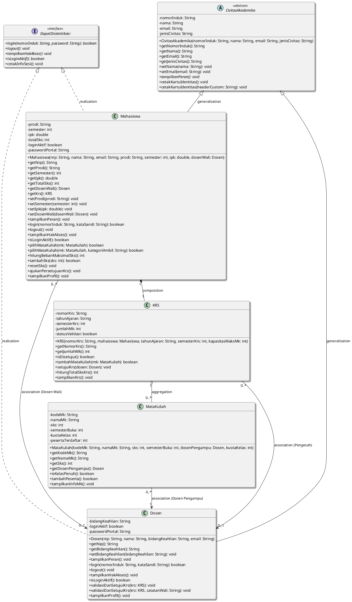

<!-- ==================== HALAMAN 1 ==================== -->
# LAPORAN PRAKTIKUM PEMROGRAMAN BERORIENTASI OBYEK
## MODUL 7: ABSTRACT CLASS, ABSTRACT METHOD, DAN INTERFACE
**Project-Based Learning & Agile Development (Sistem Informasi Akademik / SIAKAD)**

---

### 1. IDENTITAS MAHASISWA & PROYEK
* **Nama Proyek** : Refactoring SIAKAD P6 ke P7 Menggunakan Abstract Class & Interface
* **Nama Mahasiswa** : Mohamad Zaky Bahtiar Arifianto
* **NRP** : 3125522015
* **Program Studi** : D3 Teknik Informatika (PSDKU Sumenep)
* **Institusi** : Politeknik Elektronika Negeri Surabaya (PENS)
* **Mata Kuliah** : Praktikum Pemrograman Berorientasi Obyek
* **Dosen Pengampu** : Nirwana Haidar Hari, S.Pd., M.Kom.

---

### 2. SPRINT GOAL
> **Sprint Goal P7**: Mengembangkan desain proyek P6 dengan menerapkan abstract class dan interface yang sesuai sehingga struktur class lebih jelas, perilaku object memiliki kontrak yang konsisten, dan program tetap dapat dijalankan tanpa merusak relasi dan fitur yang telah ada sebelumnya.

---

### 3. SPRINT BACKLOG (P7 AGILE SPRINT)
Seluruh item backlog pada sprint ini telah diselesaikan dengan status **DONE**:

| Backlog ID | Deskripsi Task Backlog | Target Delivery | Status |
| :--- | :--- | :--- | :---: |
| **SB-01** | Audit hierarchy dan behavior proyek P6 | Identifikasi superclass, subclass, dan peluang kontrak interface | **DONE** |
| **SB-02** | Menentukan kandidat abstract class | Menetapkan `CivitasAkademika` sebagai kerangka umum non-instantiable | **DONE** |
| **SB-03** | Menentukan abstract method | Menetapkan method abstrak `tampilkanPeran()` tanpa implementasi body | **DONE** |
| **SB-04** | Menentukan kandidat interface | Merancang interface kontrak `DapatDiotentikasi` untuk portal SIAKAD | **DONE** |
| **SB-05** | Memperbarui class diagram | Update UML dengan notasi generalization (`--\|>`) dan realization (`..\|>`) | **DONE** |
| **SB-06** | Mengimplementasikan abstract class dan interface | Refactoring kode Java, constructor chaining `super`, dan implements | **DONE** |
| **SB-07** | Menguji polymorphism dan program | Eksekusi 4 skenario polymorphism runtime & interface di `Main.java` | **DONE** |

---

### 4. TABEL AUDIT DESAIN P6 KE P7
Analisis komparatif arsitektur class dan perilaku object dari Modul 6 menuju Modul 7:

| Class / Behavior | Kondisi P6 | Rencana P7 | Alasan Keputusan Desain |
| :--- | :--- | :--- | :--- |
| **CivitasAkademika** | Concrete Superclass (dapat diinstansiasi langsung via `new`) | **Abstract Class** (`abstract class CivitasAkademika`) | Entitas "CivitasAkademika" hanya mewakili konsep umum abstrak warga kampus di dunia nyata. Tidak ada individu riil yang berstatus "hanya civitas" tanpa peran spesifik. Mengubahnya menjadi abstract class mencegah instansiasi ilegal yang tidak memiliki peran operasional. |
| **tampilkanPeran()** | Concrete Method dengan body default umum | **Abstract Method** (`public abstract void tampilkanPeran();`) | Setiap subclass (`Mahasiswa` dan `Dosen`) memiliki tanggung jawab, hak, dan peran fungsional yang sepenuhnya berbeda. Superclass tidak boleh mendikte implementasi default semu, melainkan harus memaksa subclass mengimplementasikannya sendiri. |
| **DapatDiotentikasi** | Belum tersedia (belum ada kontrak akses portal) | **Interface Baru** (`public interface DapatDiotentikasi`) | Mahasiswa dan Dosen sama-sama memerlukan autentikasi login dan pengecekan hak akses pada portal SIAKAD. Menggunakan interface memisahkan definisi kontrak keamanan portal dari hirarki pewarisan biologis/struktural civitas. |
| **Mahasiswa & Dosen** | Subclass konkret biasa | Subclass konkret `extends CivitasAkademika implements DapatDiotentikasi` | Memenuhi kontrak implementasi abstract method superclass sekaligus merealisasikan seluruh kontrak otentikasi portal secara konsisten. |
| **Relasi P4 (KRS, MataKuliah)** | Asosiasi, Agregasi, dan Komposisi aktif | Dipertahankan 100% utuh tanpa breaking change | Memastikan prinsip Agile Refactoring: peningkatan struktur abstraksi tanpa merusak kapabilitas bisnis yang telah berjalan sebelumnya. |

<!-- ==================== HALAMAN 2 ==================== -->
<div style="page-break-before: always;"></div>

---

### 5. CLASS DIAGRAM UML (PLANTUML SCRIPT)

Berikut merupakan representasi UML Class Diagram Modul 7 yang memadukan pewarisan (`Generalization`), implementasi antarmuka (`Realization`), dan relasi objek P4 (`Association`, `Aggregation`, `Composition`):



---

### 6. PENJELASAN DESAIN ARSITEKTUR BERORIENTASI OBJEK

1. **Alasan Pemilihan `CivitasAkademika` sebagai Abstract Class**:
   Dalam domain perguruan tinggi, `CivitasAkademika` merupakan konsep murni (generalisasi semantik) yang memayungi seluruh warga kampus. Tidak pernah ada individu yang hadir di kampus berstatus "hanya CivitasAkademika" tanpa memiliki peran operasional yang spesifik, apakah ia seorang mahasiswa penempuh studi atau dosen pengajar. Menjadikan class ini `abstract` melindungi integritas arsitektur dari instansiasi ilegal (`new CivitasAkademika(...)` dicegah pada tingkat kompilasi Java), sekaligus tetap menyediakan mekanisme *code reuse* yang andal untuk atribut bersama (`nomorInduk`, `nama`, `email`) melalui *constructor chaining* (`super(...)`).

2. **Alasan Penetapan `tampilkanPeran()` sebagai Abstract Method**:
   Meskipun setiap civitas pasti memiliki peran, superclass tidak mungkin mendefinisikan implementasi peran yang seragam tanpa mengorbankan ketepatan logika. Mahasiswa berfokus pada pengambilan SKS dan penyusunan rencana studi, sedangkan dosen berfokus pada Tridharma, pengajaran, dan validasi akademik. Menetapkan `tampilkanPeran()` sebagai `public abstract void` menetapkan *mandatory contract* yang mewajibkan seluruh subclass turunan meng-override method ini sesuai karakteristik alaminya, menjamin kepatuhan polimorfik tanpa body semu di superclass.

3. **Alasan Perancangan Interface `DapatDiotentikasi` dan Pemenuhan Kontrak**:
   Keamanan dan otentikasi portal sistem informasi akademik merupakan kebutuhan lintas-peran (*orthogonal behavior*). Baik mahasiswa maupun dosen harus memiliki kapabilitas login, logout, dan verifikasi hak akses sebelum menggunakan SIAKAD. Namun, otoritas operasional keduanya berbeda drastis. Interface `DapatDiotentikasi` bertindak sebagai kontrak kapabilitas resmi tanpa merusak rantai pewarisan tunggal (*single inheritance*). Hal ini memungkinkan program memperlakukan Mahasiswa dan Dosen secara seragam melalui tipe referensi interface (`DapatDiotentikasi auth = ...`), menjunjung tinggi *Interface Segregation Principle* dan *Open/Closed Principle*.

<!-- ==================== HALAMAN 3 ==================== -->
<div style="page-break-before: always;"></div>

---

### 7. BUKTI EKSEKUSI & SCREENSHOT RUNNING TERMINAL

```
+----------------------------------------------------------------------------------------------------+
|                                [PLACEHOLDER SCREENSHOT RUNNING PROGRAM]                            |
|             (Simpan tangkapan layar terminal kompilasi dan eksekusi Main.java di sini)             |
+----------------------------------------------------------------------------------------------------+
```

#### Cuplikan Teks Output Terminal Aktual:
```text
==========================================================================
     PRAKTIKUM PEMROGRAMAN BERORIENTASI OBYEK (PBO) - MODUL 7             
          Abstract Class, Abstract Method, dan Interface                  
==========================================================================
Nama Mahasiswa : Mohamad Zaky Bahtiar Arifianto (NRP: 3125522015)
Institusi      : Politeknik Elektronika Negeri Surabaya (PENS PSDKU Sumenep)

[SKENARIO 1: INSTANSIASI OBJECT SUBCLASS KONKRET BERHASIL DIBUAT]
[SUKSES] Objek Subclass Konkret Berhasil Dibuat:
1. Mahasiswa : Mohamad Zaky Bahtiar Arifianto (NRP: 3125522015)
2. Mahasiswa : Ahmad Wildan Prasetyo (NRP: 3125522022)
3. Dosen     : Nirwana Haidar Hari, S.Pd., M.Kom. (NIP: 198504122010121003)
4. Dosen     : Firman Arifin, S.T., M.T. (NIP: 197806212005011002)

[SKENARIO 2: PEMANGGILAN ABSTRACT METHOD VIA REFERENCE SUPERCLASS]
Tipe Referensi : CivitasAkademika (Abstract Class) -> Objek Aktual: Mahasiswa
Output: [PERAN MAHASISWA] Mohamad Zaky Bahtiar Arifianto (3125522015) - Menempuh studi pada program D3 Teknik Informatika...
Tipe Referensi : CivitasAkademika (Abstract Class) -> Objek Aktual: Dosen
Output: [PERAN DOSEN] Nirwana Haidar Hari, S.Pd., M.Kom. (198504122010121003) - Menjalankan Tridharma Perguruan Tinggi...

[SKENARIO 3: PEMANGGILAN METHOD MELALUI REFERENCE INTERFACE]
>> [LOGIN BERHASIL] Mahasiswa Mohamad Zaky Bahtiar Arifianto (3125522015) berhasil masuk ke Portal SIAKAD.
[STATUS SESI PORTAL] AKTIF (Terotentikasi)
Hak Akses Mahasiswa: Registrasi KRS, Monitoring KHS & IPK, Pengajuan Bimbingan Wali.
>> [LOGIN BERHASIL] Dosen Nirwana Haidar Hari, S.Pd., M.Kom. (198504122010121003) berhasil masuk ke Portal SIAKAD.
[STATUS SESI PORTAL] AKTIF (Terotentikasi)
Hak Akses Dosen: Validasi KRS Mahasiswa, Input Nilai Mata Kuliah, Monitoring Evaluasi Studi.

[SKENARIO 4: POLYMORPHISM KOLEKTIF DENGAN PERULANGAN FOR-EACH]
Iterasi Array CivitasAkademika[] & DapatDiotentikasi[] sukses mengeksekusi perilaku unik masing-masing objek.
```

---

### 8. PENJELASAN HASIL 4 SKENARIO PENGUJIAN POLYMORPHISM

| No | Skenario Pengujian | Hasil Aktual Eksekusi | Status |
| :---: | :--- | :--- | :---: |
| **1** | Instansiasi objek subclass konkret | Objek `Mahasiswa` dan `Dosen` berhasil diinstansiasi dengan constructor chaining `super(...)`. Instansiasi ilegal `CivitasAkademika` dicegah oleh compiler. | **SUKSES** |
| **2** | Pemanggilan abstract method via reference superclass | Referensi `CivitasAkademika` sukses memanggil `tampilkanPeran()` dan runtime mengeksekusi method konkret milik objek aktual (Mahasiswa / Dosen). | **SUKSES** |
| **3** | Pemanggilan method melalui reference interface | Referensi `DapatDiotentikasi` sukses memanggil `login()`, `tampilkanHakAkses()`, dan `cetakInfoSesi()` sesuai kontrak autentikasi portal masing-masing peran. | **SUKSES** |
| **4** | Polymorphism kolektif via Array dengan loop for-each | Array `CivitasAkademika[]` dan `DapatDiotentikasi[]` dieksekusi via looping for-each; dynamic binding mengeksekusi perilaku khas masing-masing objek tanpa *type-casting* manual. | **SUKSES** |

---

### 9. SPRINT REVIEW (CHECKLIST VERIFIKASI)

| No | Kriteria Evaluasi Sprint Review | Hasil Verifikasi Sistem | Status |
| :---: | :--- | :--- | :---: |
| 1 | Abstract class berhasil dibuat | Class `CivitasAkademika` bertipe `abstract` dengan atribut terenkapsulasi | **TERVERIFIKASI** |
| 2 | Abstract method diimplementasikan subclass | Method `tampilkanPeran()` diimplementasikan penuh di `Mahasiswa` dan `Dosen` | **TERVERIFIKASI** |
| 3 | Minimal 2 subclass konkret aktif | Subclass `Mahasiswa` dan `Dosen` aktif dan beroperasi normal | **TERVERIFIKASI** |
| 4 | Interface berhasil diimplementasikan | Interface `DapatDiotentikasi` diimplementasikan dengan kata kunci `implements` | **TERVERIFIKASI** |
| 5 | Class diagram sesuai dengan kode | Diagram PlantUML mencerminkan generalization, realization, dan relasi P4 | **TERVERIFIKASI** |
| 6 | Pengujian polymorphism berhasil | Seluruh 4 skenario polymorphism dieksekusi dengan hasil 100% valid | **TERVERIFIKASI** |
| 7 | Fitur proyek sebelumnya tetap berjalan | Enkapsulasi, relasi P4 (Asosiasi, Agregasi, Komposisi), dan Overloading utuh | **TERVERIFIKASI** |

---

### 10. SPRINT RETROSPECTIVE

* **What Went Well?**:
  Proses refactoring dari concrete class ke abstract class `CivitasAkademika` serta implementasi interface `DapatDiotentikasi` berjalan sangat mulus tanpa menimbulkan konflik pada relasi P4 yang telah dibangun sebelumnya. Polimorfisme berbasis kontrak antarmuka mampu memisahkan logika hak akses portal SIAKAD secara elegan, sementara abstract method menjamin standardisasi perilaku civitas kampus.

* **What Went Wrong?**:
  Tantangan utama yang dihadapi adalah menentukan batas pemisah yang tegas antara apa yang layak dimasukkan sebagai abstract method di superclass versus apa yang harus dijadikan interface kontrak. Awalnya terdapat godaan untuk memasukkan method otentikasi langsung ke dalam `CivitasAkademika`, namun hal tersebut menyalahi prinsip kohesi dan berpotensi membebani hirarki turunan yang mungkin kelak tidak membutuhkan akses portal.

* **Improvement?**:
  Untuk persiapan menghadapi Evaluasi Tengah Semester (UTS P8), tim akan memperdalam pemahaman mengenai integrasi pola perancangan lanjut (*Design Patterns* seperti Factory Method atau Strategy) dan penyempurnaan rancangan UML agar mapping ke source code Java berjalan otomatis, terstruktur, dan siap dikembangkan lebih jauh pada P9.
